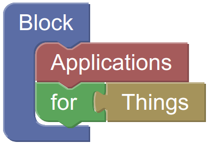

# BLAST - Block Applications For Things 
A visual programming environment (VPE) for creating and executing applications, that communicate and interact with devices from the Web of Things ([WoT](https://www.w3.org/TR/wot-architecture/)).

Employing a VPE, BLAST makes creating WoT Applications more accessible: Without knowing any details of the technologies or communication protocols used by a device, users can create complete Programs that read or write its properties, invoke actions on it and listen to its events. Programs can then be executed on desktop pcs, smartphones and tablets.

Check [./docs/](docs/) for detailed documentation.

## Usage
To view a web demo of BLAST, open `examples/web/index.html` in your favorite browser or see https://paul.ti.rw.fau.de/~qa60fyri/testing/blast/examples/web/ for an online version.
If you want to use the save/load features, however you have to host the files on a server, see [Saving & loading](#saving--loading) for more info on this.

> :warning: **Blocks that perform fetch requests, like the http-request or the SPARQL-blocks, require BLAST to be hosted on a server.**  

> :warning: **BLAST's BlueTooth blocks require you to use Chrome 89 or newer on Windows with `chrome://flags/#enable-experimental-web-platform-features` enabled.**

### WebHID on Linux
On most Linux systems, the udev subsystem blocks write access to HID devices. In order to unblock access, each device requires its own udev rule. See the [device section](https://github.com/wintechis/blast/wiki/Devices) of the wiki for step by step instructions for all devices used by BLAST.

### Compatibility
This table displays all blocks with limited compatibility, assuming you're using **google chrome version 85, or newer**, and have the **`experimental web platform features flag` enabled**.

| block | Windows | Linux | Mac | Android |
|---|---|---|---|---|
| switch LED | :heavy_check_mark: | :heavy_check_mark: | :heavy_check_mark: | :heavy_check_mark: |
| read signal strength | :heavy_check_mark: | :x:[^1] | :heavy_check_mark: | :heavy_check_mark: |
| read ruuvi property | :heavy_check_mark: | :x:[^2] | :heavy_check_mark: | :heavy_check_mark: |

[^1]: https://bugs.chromium.org/p/chromium/issues/detail?id=897312
[^2]: https://bugs.chromium.org/p/chromium/issues/detail?id=654897

If you need Linux compatibility, it might help to star this [watchAdvertisement implementation issue](https://bugs.chromium.org/p/chromium/issues/detail?id=654897&q=watchAdvertisements&can=2) and to help us implement new features, star the [Bluetooth Scanning issue](https://bugs.chromium.org/p/chromium/issues/detail?id=897312). 

### Notes

* [Android](https://crbug.com/471536): Requires Android 6.0 Marshmallow or later.
* [Mac](https://crbug.com/364359): Requires OS X Yosemite or later.
  * Some MacBooks may not work: Check "About this Mac" / "System Report" / "Bluetooth" and verify that Low Energy is supported.
* [Linux](https://crbug.com/570344): Requires Kernel 3.19+ and [BlueZ](http://www.bluez.org/) 5.41+ installed. Read [How to get Chrome Web Bluetooth working on Linux](https://acassis.wordpress.com/2016/06/28/how-to-get-chrome-web-bluetooth-working-on-linux/).
  * Note that Bluetooth daemon needs to run with experimental interfaces if BlueZ version is lower than 5.43: `sudo /usr/sbin/bluetoothd -E`
* [Windows](https://crbug.com/507419): Requires Windows 10 version 1706 (Creators Update) or later.

### Saving & Loading
Loading block programs requires BLAST to be hosted on a server. In addition, if you want to save block programs you'll need to create a directory that allows HTTP-PUT requests, see [here](https://github.com/wintechis/wilde13/blob/master/FAQ.md#how-can-i-create-a-read-write-linked-data-server-based-on-the-apache-http-server) for instructions.

### Customizing BLAST
The BLAST library allows developers to customize its output method to adapt to their own UI. See [integration.md](./integration.md) for detailed information on how to do this.

### Building
In order to build BLAST yourself, follow these steps:
1. install [yarn](https://yarnpkg.com/)
2. run `yarn` from within the root directory
3. run `yarn run build` from within the root directory

## Planned features
* **auto generate things blocks** - automatically generate `property`, `action`, and `event` blocks from its [things description](https://www.w3.org/TR/wot-thing-description/)
* **unit testing** add unit tests
  
For smaller planned improvements see [issues](https://github.com/wintechis/blast/issues)

## Contributing
Please see [CONTRIBUTING.md](CONTRIBUTING.md).
