# BLAST Block Overview
This document describes the BLAST blocks in detail. For a formal syntax definition check the first section [Syntax](#Syntax) and to learn about the blocks semantic see [Semantic](#Semantic).

Contents:
* [**Syntax**](#Syntax)
    * [**EBNF**](#EBNF)
    * [**terminals**](#terminals)
* [**Semantic**](#semantic)
    * [**things**](#things-blocks)
    * [**actions**](#action-blocks)
    * [**logic**](#logic-blocks)
    * [**text**](#text-blocks)
    * [**numbers**](#number-blocks)

## Syntax
This section gives an overview of the syntax used in BLAST

### Extended Backus-Naur Form
The following describes BLAST's syntax using the [W3C EBNF Notation](https://www.w3.org/TR/2010/REC-xquery-20101214/#EBNFNotation).

```
block-program            ::= (setup loop)
setup                    ::= ( action | conditional-statement )*
loop                     ::= ( action | conditional-statement )*
action                   ::= ( display-text | display-data | switch-lights)
conditional-statement    ::= ( if | if-else )
display-text             ::= (text | number | iBeacon-data)
display-data             ::= iBeacon receiver
switch-lights            ::= iBeacon
if                       ::= boolean ( action | conditional-statement )*
if-else                  ::= boolean ( action | conditional-statement )*
text                     ::= ( text-value | text-create )
number                   ::= ( number-value | number-infinity | arithmetic-operations | number-random )
iBeacon-data             ::= iBeacon receiver
iBeacon                  ::= iBeaconObject
boolean                  ::= ( boolean-value | comparison | logical-operation | not )
receiver                 ::= receiverObject
text-value               ::= StringLiteral
text-create              ::= text (text)*
number-value             ::= DoubleLiteral
number-infinity          ::= DoubleLiteral
arithmetic-operations    ::= number number
number-random            ::= number number
boolean-value            ::= booleanLiteral
comparison               ::= (number | text ) (number | text )
logical-operation        ::= boolean boolean
not                      ::= boolean
```

### Terminals
This table aims to describe the terminals used in the EBNF above.
terminal | description | example
---| --- | ---
StringLiteral | any visible character and the whitespace character, no termination characters (newline, carriage return, tabs, ...) | `hello world!`
DoubleLiteral | a floating point number | `3.14`
BooleanLiteral  | a boolean (*true* or *false*) | `true`
iBeaconObject| these blocks returns the address the iBeacon's RDF graph can be found at | `http://localhost/iBeacon/deadbeef` 
receiverObject | these blocks returns the address the receivers's RDF graph can be found at | `http://localhost/iBeacon/` 

## Semantic
This section explains the semantic of the blocks used in BLAST.

In BLAST there are 5 categories of blocks:
* [**process**](#process-blocks): The setup- and loop-block control the block programs process order
* [**things**](#things-blocks): Blocks representing and retrieving data from things
* [**actions**](#action-blocks): Display measured data, custom messages or setting the LEDs of a signal light
* [**logic**](#logic-blocks): Everything concerning boolean logic, like if, if-else blocks and events
* [**text**](#text-blocks): Text creation and manipulation blocks
* [**numbers**](mumber-blocks): represent numbers and enable basic arithmetic

Descriptions of these blocks can be found in the following.

## process-blocks
The [**setup**](#setup) and [**loop**](#loop) blocks control the block programs process order

### setup
Every block in the setup-block get's executed once at program start.


**input:** *action* or *conditional statement*  
**output:** *no output*

Before executing the setup block, BLAST parses every *iBeaconObject* and *receiverObject* inside it (`getAllAdresses()`) and runs a SPARQL-query using [µRDF](https://github.com/vcharpenay/uRDF.js) to get their current data (`queryAlliBeacons(addresses)`). Afterwards the blocks in the setup block are executed consecutively, starting with the topmost block.
```JavaScript
// clear process array
var setup = [];

// query data first
var addresses = getAllAddresses();
queryAlliBeacons(addresses).then(() => {
var code = Blockly.JavaScript.workspaceToCode(workspace);

// writes block-code into arrays
eval(code);

// execute block code
for (process of setup) {
    eval(process);
}
```

Below is the SPARQL query executed by `queryAlliBeacons`.
```JavaScript
var query =
`BASE <${baseUrl}>
PREFIX scp: <https://github.com/aharth/supercool/>
PREFIX sosa: <http://www.w3.org/ns/sosa/>
PREFIX qudt: <http://qudt.org/1.1/schema/qudt#>

SELECT ?ap ?mac ?rssi ?resultTime ?accuracy ?major ?minor ?measuredPower ?proximity
FROM <${path}>
WHERE 
{
    ?ble sosa:madeBySensor ?apfull .
    BIND(substr(?apfull, 7,1) AS ?ap) .
    ?ble sosa:hasResult ?sensor .
    ?sensor scp:MacAddress ?mac .
    ?sensor qudt:numericValue ?rssi .
    ?sensor sosa:resultTime ?resultTime .
    ?sensor scp:accuracy ?accuracy .
    ?sensor scp:major ?major .
    ?sensor scp:major ?minor .
    ?sensor scp:measuredPower ?measuredPower .
    ?sensor scp:proximity ?proximity .
} ORDER BY ?ap ?mac`;
```


### loop
The blocks withing the loop-block are executed consecutively `n`-times every `x` seconds according to the parameters .

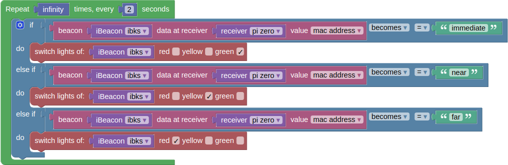

**input:** *number* *number*  
**output:** *no output*

Like with the [setup](#setup) block, RDF-data is queried before each execution of the loop block. Then the blocks within the loop block are executed consecutively.  
Additionally the loop block writes each data retrieved from the RDF-graphs to a map to store previous results. This map (`prevResultsMap`) is used by the [event](#event)-block to compare previous and current results.

```JavaScript
prevResultsMap = new Map(resultsMap);

//eval loop
var setupBlock = workspace.getBlockById("setup");
var addresses = getiBeaconAddressesInBlock(setupBlock);
var loopCounter = 0
interval = setInterval(function () {
    loopCounter++;

    var addresses = getAllAddresses();
    queryAlliBeacons(addresses).then(() => {

    for (process of loop) {
        console.log(process);
        eval(process);
    }
    });

    prevResultsMap = new Map(resultsMap);
    if (loopCounter == loop_n) {
    stopCode('finished');
    }
}, loopTime * 1000)
```

## things-blocks
There are 3 different blocks in this category: [**iBeacon**](#iBeacon), [**receiver**](#receiver) and [**iBeacon-data**](#iBeacon-data).

### iBeacon
The iBeacon block represents an iBeacon


**input:** *no input*  
**output:** *iBeaconObject*

to create a new iBeacon click the `create new thing` button in the things category.  
Internally, this stores the address of the iBeacon's RDF-graph in a map.

On execution the iBeacon block then retrieves the address of the iBeacon's RDF-graph from this map.

```JavaScript
Blockly.JavaScript['iBeacon_get'] = function (block) {
  var thingName = block.getFieldValue('thing');
  var iBeacons = Blockly.Things.thingsMap.iBeacon;
  var thing = iBeacons[thingName];
  
  return [thing.address.trim(), Blockly.JavaScript.ORDER_NONE];
};
```

### receiver
The receiver block represents a Bluetooth receiver.


**input:** *no input*  
**output:** *receiverObject*

to create a new receiver click the `create new receiver` button in the things category.
Internally, this stores the address of the receiver's RDF-graph in a map.

On execution the receiver block then retrieves the address of the receivers's RDF-graph from this map.

```JavaScript
Blockly.JavaScript['receiver_get'] = function (block) {
  var thingName = block.getFieldValue('thing');
  var receiver = Blockly.Things.thingsMap.receiver;
  var thing = receiver[thingName];

  return [thing.address.trim(), Blockly.JavaScript.ORDER_NONE];
};
```

### iBeacon-data
The iBeacon-data block retrieves data iBeacon data.


**input:** *thing*  *receiver*  
**output:** *string* | *number* - the retrieved data

Data is retrieved from the results map created on execution of the [setup](#setup)- or [loop](#loop)-block.

```JavaScript
Blockly.JavaScript['iBeacon_data'] = function (block) {
  var iBeacon = Blockly.JavaScript.valueToCode(block, 'iBeacon', Blockly.JavaScript.ORDER_NONE);
  var receiver = Blockly.JavaScript.valueToCode(block, 'receiver', Blockly.JavaScript.ORDER_NONE);
  var value = block.getFieldValue('value');

  var code = `resultsMap.get("${receiver}").get("${iBeacon}")["${value}"].value`;

  return [code, Blockly.JavaScript.ORDER_NONE];
};
```


## action blocks
There are 3 different blocks in this category: [**display text**](#display-text), [**display data**](#display-data) and [**switch lights**](#switch-lights). 

### display text
The display text block adds a text container to the action-block output container on the right.

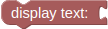
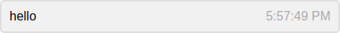

**input:** *text* | *number*  
**output:** *no output*

This block calls the `insertMessage(text)` function to insert it's input into a message container in the action-block-output container.
```JavaScript
Blockly.JavaScript['message'] = function (block) {
  var text_msg = Blockly.JavaScript.valueToCode(block, 'NAME', Blockly.JavaScript.ORDER_NONE) || '\'\'';

  var code = `insertMessage(${text_msg})\n`;
  return code;
};
```

### display data
The display data block prints a table containing all the data received at a receiver to the action-block output container on the right.

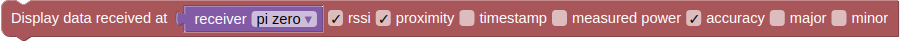
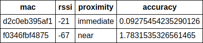

**input:** *receiver*  
**output:** *no output*

When executed this block writes the check-box values into an array and calls the `displayTable` function (see below).
```JavaScript
Blockly.JavaScript['display'] = function (block) {
  var value_thing = Blockly.JavaScript.valueToCode(block, 'thing', Blockly.JavaScript.ORDER_NONE);
  var checkbox_show_rssi = block.getFieldValue('show_rssi') == 'TRUE';
  var checkbox_show_proximity = block.getFieldValue('show_proximity') == 'TRUE';
  var checkbox_timestamp = block.getFieldValue('timestamp') == 'TRUE';
  var checkbox_show_measured_power = block.getFieldValue('show_measured_power') == 'TRUE';
  var checkbox_show_accuracy = block.getFieldValue('show_accuracy') == 'TRUE';
  var checkbox_show_major = block.getFieldValue('show_major') == 'TRUE';
  var checkbox_show_minor = block.getFieldValue('show_minor') == 'TRUE';

  // checkboxes are booleans for {showRSSI, showResultTime, showAccuracy, 
  //  showMajor, showMinor, showMeasuredPower, showProximity}
  checkboxes = ["mac"];
  if(checkbox_show_rssi) checkboxes.push("rssi");
  if(checkbox_show_proximity) checkboxes.push("proximity");
  if(checkbox_timestamp) checkboxes.push("resultTime");
  if(checkbox_show_measured_power) checkboxes.push("measuredPower");
  if(checkbox_show_accuracy) checkboxes.push("accuracy");
  if(checkbox_show_major) checkboxes.push("major");
  if(checkbox_show_minor) checkboxes.push("minor");

  code = `displayTable("${value_thing}", ['${checkboxes.join("','")}']);`;
  return code;
}
```

The `displayTable` function retrieves the data identified by `key` from `resultsMap` and creates a HTML table containing the values where `checkboxes` is true.
```JavaScript
function displayTable(key, checkboxes) {

    let resultsField = document.createElement("table");

    // deal with missing values
    results = resultsMap.get(key);
    let vars = checkboxes;

    let html = '<tr>';
    vars.forEach(v => html += '<th>' + v + '</th>');
    html += '</tr>';

    results.forEach(res => {
    html += '<tr>';
    vars.forEach(v => {
        html += '<td>' + (res[v] ? res[v].value : '') + '</td>'
    });
    html += '</tr>';
    });

    resultsField.innerHTML = html;

    var div = document.getElementById("messageBox");
    div.insertBefore(resultsField, div.firstChild);
}
```

### switch lights
The switch lights block can be used to control the LEDs of a [LED strip controller](https://github.com/arduino12/ble_rgb_led_strip_controller).

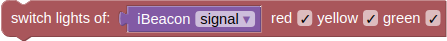

**input:** *iBeacon*  
**output:** *no output*

This block redirects it's input to the `switchLights(mac, r, y, g)` function, which then sends a HTTP-POST request to the [sc-ble-adapter](https://github.com/wintechis/sc-ble-adapter/) which controls the [LED strip controller](https://github.com/arduino12/ble_rgb_led_strip_controller) specified by `mac`.


```JavaScript
Blockly.JavaScript['switchlights'] = function(block) {
  var cb_red = block.getFieldValue('cb_red') == 'TRUE';
  var cb_yellow = block.getFieldValue('cb_yellow') == 'TRUE';
  var cb_green = block.getFieldValue('cb_green') == 'TRUE';
  var iBeacon = Blockly.JavaScript.valueToCode(block, 'light', Blockly.JavaScript.ORDER_NONE);
  
  var code = `switchLights("${iBeacon}", ${cb_red}, ${cb_yellow}, ${cb_green});`;
  return code;
};
```

```JavaScript
function switchLights(mac, r, y, g) {
    console.log("foo");
    var r_byte = r ? "ff" : "00";
    var y_byte = y ? "ff" : "00";
    var g_byte = g ? "ff" : "00";

    var data = { type: "WriteWithoutResponse", data: "7e000503" + r_byte + g_byte + y_byte + "00ef" };

    fetch("http://raspberrypi.local:8000/devices/be5860006ad4/char/0009/", {
    method: "POST",
    headers: new Headers({
        "Content-Type": "application/json"
    }),
    body: JSON.stringify(data)
    }).then(res => {
    console.log("Request complete!");
    })
}
```

## logic blocks
Logic blocks are used to implement [boolean logic](https://en.wikipedia.org/wiki/Boolean_algebra).  

If a block expects a Boolean value as an input, it usually interprets an absent input as **false**. Non-Boolean values cannot be directly plugged in where Boolean values are expected.

### boolean-value
The value block represents a boolean value

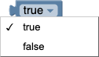

**input:** *no input*  
**output:** *boolean*

This block returns `true` or `false` depending on the value selected from the dropdown.
```JavaScript
Blockly.JavaScript['logic_boolean'] = function(block) {
  // Boolean values true and false.
  var code = (block.getFieldValue('BOOL') == 'TRUE') ? 'true' : 'false';
  return [code, Blockly.JavaScript.ORDER_ATOMIC];
};
```

### comparison
There are six comparison operators. Each takes two inputs and returns true or false depending on how the inputs compare with each other.

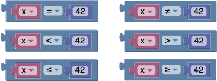

The six operators are: equals, not equals, less than, greater than, less than or equal, greater than or equal.

**input:** (*text* | *number*), (*text* | *number*)  
**output:** *boolean*

On execution this block returns JavaScript code, that compares two values when evaluated.
```JavaScript
Blockly.JavaScript['logic_compare'] = function(block) {
  // Comparison operator.
  var OPERATORS = {
    'EQ': '==',
    'NEQ': '!=',
    'LT': '<',
    'LTE': '<=',
    'GT': '>',
    'GTE': '>='
  };
  var operator = OPERATORS[block.getFieldValue('OP')];
  var order = (operator == '==' || operator == '!=') ?
      Blockly.JavaScript.ORDER_EQUALITY : Blockly.JavaScript.ORDER_RELATIONAL;
  var argument0 = Blockly.JavaScript.valueToCode(block, 'A', order) || '0';
  var argument1 = Blockly.JavaScript.valueToCode(block, 'B', order) || '0';
  var code = argument0 + ' ' + operator + ' ' + argument1;
  return [code, order];
};
```

### logical operation
This block represents the logical operations *and* and *or*.


**input:** *boolean*, *boolean*  
**output:** *boolean*

On execution this block returns JavaScript code, that performs the logic operation selected in the dropdown when evaluated.
```JavaScript
Blockly.JavaScript['logic_operation'] = function(block) {
  // Operations 'and', 'or'.
  var operator = (block.getFieldValue('OP') == 'AND') ? '&&' : '||';
  var order = (operator == '&&') ? Blockly.JavaScript.ORDER_LOGICAL_AND :
      Blockly.JavaScript.ORDER_LOGICAL_OR;
  var argument0 = Blockly.JavaScript.valueToCode(block, 'A', order);
  var argument1 = Blockly.JavaScript.valueToCode(block, 'B', order);
  if (!argument0 && !argument1) {
    // If there are no arguments, then the return value is false.
    argument0 = 'false';
    argument1 = 'false';
  } else {
    // Single missing arguments have no effect on the return value.
    var defaultArgument = (operator == '&&') ? 'true' : 'false';
    if (!argument0) {
      argument0 = defaultArgument;
    }
    if (!argument1) {
      argument1 = defaultArgument;
    }
  }
  var code = argument0 + ' ' + operator + ' ' + argument1;
  return [code, order];
};
```

### not
The not block converts its Boolean input into its opposite. For example, the result of:  
  
is **false**

**input:** *boolean*  
**output:** *boolean*

The not-block calls a function that negates the boolean in the argument.
```JavaScript
Blockly.JavaScript['logic_negate'] = function(block) {
  // Negation.
  var order = Blockly.JavaScript.ORDER_LOGICAL_NOT;
  var argument0 = Blockly.JavaScript.valueToCode(block, 'BOOL', order) ||
      'true';
  var code = '!' + argument0;
  return [code, order];
};
```

### if / if-else
The simplest conditional statement is an **if** block, as shown:
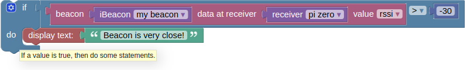
When run, this will compare the RSSI value of the thing **my beacon** to -30. If it is larger, "Beacon is close!" will be displayed. Otherwise, nothing happens.

It is also possible to specify that something should happen if the condition is *not* true, as shown in this example:

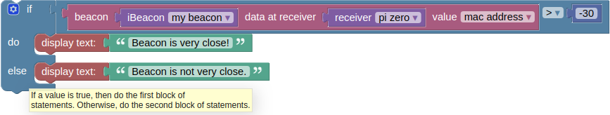

As with the previous block, "Beacon is close!" will be displayed if the RSSI value of **my beacon** > -30; otherwise, "Beacon is not very close." will be displayed.
An **if** block may have zero or one **else** sections but not more than one.

**input:** *boolean* (*action* | *conditional-statement*)*
**output:** *conditional-statement*

The underlying function, which is called upon execution returns the JavaScript representation of the if condition defined by the block.
```JavaScript
Blockly.JavaScript['controls_if'] = function(block) {
  // If/elseif/else condition.
  var n = 0;
  var code = '', branchCode, conditionCode;
  if (Blockly.JavaScript.STATEMENT_PREFIX) {
    // Automatic prefix insertion is switched off for this block.  Add manually.
    code += Blockly.JavaScript.injectId(Blockly.JavaScript.STATEMENT_PREFIX,
        block);
  }
  do {
    conditionCode = Blockly.JavaScript.valueToCode(block, 'IF' + n,
        Blockly.JavaScript.ORDER_NONE) || 'false';
    branchCode = Blockly.JavaScript.statementToCode(block, 'DO' + n);
    if (Blockly.JavaScript.STATEMENT_SUFFIX) {
      branchCode = Blockly.JavaScript.prefixLines(
          Blockly.JavaScript.injectId(Blockly.JavaScript.STATEMENT_SUFFIX,
          block), Blockly.JavaScript.INDENT) + branchCode;
    }
    code += (n > 0 ? ' else ' : '') +
        'if (' + conditionCode + ') {\n' + branchCode + '}';
    ++n;
  } while (block.getInput('IF' + n));

  if (block.getInput('ELSE') || Blockly.JavaScript.STATEMENT_SUFFIX) {
    branchCode = Blockly.JavaScript.statementToCode(block, 'ELSE');
    if (Blockly.JavaScript.STATEMENT_SUFFIX) {
      branchCode = Blockly.JavaScript.prefixLines(
          Blockly.JavaScript.injectId(Blockly.JavaScript.STATEMENT_SUFFIX,
          block), Blockly.JavaScript.INDENT) + branchCode;
    }
    code += ' else {\n' + branchCode + '}';
  }
  return code + '\n';
};
```

### event
The event block is used to describe events.  
iE it returns `true` or `false` when a measurement enters or leaves a specified range.

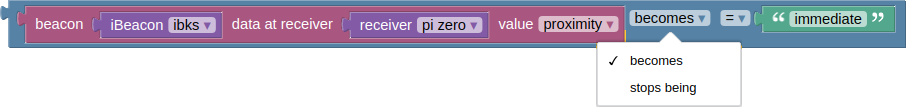)

**input:** *iBeaconObject* ( *text* | *number* )  
**output:** *boolean*

This block creates JavaScript code, that when evaluated compares the specified measurement's current result with the previous one. Those results are gathered when executing the [setup](#setup) and [loop](#loop) blocks.
```JavaScript
Blockly.JavaScript['event'] = function(block) {
  iBeaconBlock = block.getInputTargetBlock('measurement');
  var measurement = Blockly.JavaScript.valueToCode(block, 'measurement', Blockly.JavaScript.ORDER_NONE);
  var iBeacon = Blockly.JavaScript.valueToCode(iBeaconBlock, 'iBeacon', Blockly.JavaScript.ORDER_NONE);
  var receiver = Blockly.JavaScript.valueToCode(iBeaconBlock, 'receiver', Blockly.JavaScript.ORDER_NONE);
  var value = iBeaconBlock.getFieldValue('value');
  var dropdown_startstop = block.getFieldValue('startstop');
  var value_name = Blockly.JavaScript.valueToCode(block, 'NAME', Blockly.JavaScript.ORDER_NONE);

  var OPERATORS = {
    'EQ': '==',
    'NEQ': '!=',
    'LT': '<',
    'LTE': '<=',
    'GT': '>',
    'GTE': '>='
  };

  var operator = OPERATORS[block.getFieldValue('operator')];
  var order = (operator == '==' || operator == '!=') ?
  Blockly.JavaScript.ORDER_EQUALITY : Blockly.JavaScript.ORDER_RELATIONAL;

  var negate = dropdown_startstop == "BECOMES" ? "" : "!";

  var code = 
  `${negate}(!(prevResultsMap.get("${receiver}").get("${iBeacon}")["${value}"].value ${operator} ${value_name})) &&
  ${negate} (resultsMap.get("${receiver}").get("${iBeacon}")["${value}"].value ${operator} ${value_name})`;

  return [code, Blockly.JavaScript.ORDER_NONE];
};
```

## text blocks
Examples of pieces of text are:
* "thing #1"
* "March 12, 2010"
* "" (the empty text)

Text can contain letters (which may be lower-case or upper-case), numbers, punctuation marks, other symbols, and blank spaces between words.

### text-value
The following block creates the piece of text "hello".


**input:** *no input*  
**output:** *text*

When executed this block simply returns the entered text as a JavaScript string.
```JavaScript
Blockly.JavaScript['text'] = function(block) {
  // Text value.
  var code = Blockly.JavaScript.quote_(block.getFieldValue('TEXT'));
  return [code, Blockly.JavaScript.ORDER_ATOMIC];
};
```

### text create
The create text with block combines (concatenates) the value of two text blocks to create the text "hello world". Note that there is no space between them, since none was in either original text.

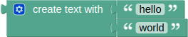

**input:** { *text* }  
**output** *text*

To increase the number of text inputs, click on the gear icon, which changes the view to:

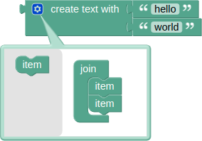

Additional inputs are added by dragging an "item" block from the gray toolbox on the left into the "join" block.

In order to concatenate strings this block adds all values to an array and then calls the JavaScript function `join()` on that array.
```JavaScript
Blockly.JavaScript['text_join'] = function(block) {
  switch (block.itemCount_) {
    case 0:
      return ['\'\'', Blockly.JavaScript.ORDER_ATOMIC];
    case 1:
      var element = Blockly.JavaScript.valueToCode(block, 'ADD0',
          Blockly.JavaScript.ORDER_NONE) || '\'\'';
      var code = Blockly.JavaScript.text.forceString_(element);
      return [code, Blockly.JavaScript.ORDER_FUNCTION_CALL];
    case 2:
      var element0 = Blockly.JavaScript.valueToCode(block, 'ADD0',
          Blockly.JavaScript.ORDER_NONE) || '\'\'';
      var element1 = Blockly.JavaScript.valueToCode(block, 'ADD1',
          Blockly.JavaScript.ORDER_NONE) || '\'\'';
      var code = Blockly.JavaScript.text.forceString_(element0) + ' + ' +
          Blockly.JavaScript.text.forceString_(element1);
      return [code, Blockly.JavaScript.ORDER_ADDITION];
    default:
      var elements = new Array(block.itemCount_);
      for (var i = 0; i < block.itemCount_; i++) {
        elements[i] = Blockly.JavaScript.valueToCode(block, 'ADD' + i,
            Blockly.JavaScript.ORDER_COMMA) || '\'\'';
      }
      var code = '[' + elements.join(',') + '].join(\'\')';
      return [code, Blockly.JavaScript.ORDER_FUNCTION_CALL];
  }
};
```

## number blocks
Number blocks are used to create and modify numbers.

### number-value
The number-value block represents a numerical value


**input:** *no input*  
**output:** *number*

This block simply returns the entered value as a JavaScript number
```JavaScript
Blockly.JavaScript['math_number'] = function(block) {
  // Numeric value.
  var code = Number(block.getFieldValue('NUM'));
  var order = code >= 0 ? Blockly.JavaScript.ORDER_ATOMIC :
              Blockly.JavaScript.ORDER_UNARY_NEGATION;
  return [code, order];
};
```

### infinity
The infinity block represent the *infinity* constant.


**input:** *no input*  
**output:** *number*

On execution this block returns a JavaScript representation of infinity
```JavaScript
Blockly.JavaScript['infinity'] = function (block) {
  return [Infinity, Blockly.JavaScript.ORDER_NONE];
}
```

### arithmetic operations
The arithmetic operations block is used to create simple arithmetic operations.

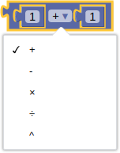

The available arithmetic operations are: addition, subtraction, multiplication, division and power.

**input:** *number* *number*  
**output:** *number*

Below is the function called when executing this block in order to create JavaScript code from the block.
```JavaScript
Blockly.JavaScript['math_arithmetic'] = function(block) {
  // Basic arithmetic operators, and power.
  var OPERATORS = {
    'ADD': [' + ', Blockly.JavaScript.ORDER_ADDITION],
    'MINUS': [' - ', Blockly.JavaScript.ORDER_SUBTRACTION],
    'MULTIPLY': [' * ', Blockly.JavaScript.ORDER_MULTIPLICATION],
    'DIVIDE': [' / ', Blockly.JavaScript.ORDER_DIVISION],
    'POWER': [null, Blockly.JavaScript.ORDER_COMMA]  // Handle power separately.
  };
  var tuple = OPERATORS[block.getFieldValue('OP')];
  var operator = tuple[0];
  var order = tuple[1];
  var argument0 = Blockly.JavaScript.valueToCode(block, 'A', order) || '0';
  var argument1 = Blockly.JavaScript.valueToCode(block, 'B', order) || '0';
  var code;
  // Power in JavaScript requires a special case since it has no operator.
  if (!operator) {
    code = 'Math.pow(' + argument0 + ', ' + argument1 + ')';
    return [code, Blockly.JavaScript.ORDER_FUNCTION_CALL];
  }
  code = argument0 + operator + argument1;
  return [code, order];
};
```

### random integer
This block creates a random integer in between the defined boundaries.


**input:** *number* *number*  
**output:** *number*

This block returns JavaScript code utilizing the `Math.random()` function to create a random number in the range specified by the blocks' arguments.
```JavaScript
Blockly.JavaScript['math_random_int'] = function(block) {
  // Random integer between [X] and [Y].
  var argument0 = Blockly.JavaScript.valueToCode(block, 'FROM',
      Blockly.JavaScript.ORDER_COMMA) || '0';
  var argument1 = Blockly.JavaScript.valueToCode(block, 'TO',
      Blockly.JavaScript.ORDER_COMMA) || '0';
  var functionName = Blockly.JavaScript.provideFunction_(
      'mathRandomInt',
      ['function ' + Blockly.JavaScript.FUNCTION_NAME_PLACEHOLDER_ +
          '(a, b) {',
       '  if (a > b) {',
       '    // Swap a and b to ensure a is smaller.',
       '    var c = a;',
       '    a = b;',
       '    b = c;',
       '  }',
       '  return Math.floor(Math.random() * (b - a + 1) + a);',
       '}']);
  var code = functionName + '(' + argument0 + ', ' + argument1 + ')';
  return [code, Blockly.JavaScript.ORDER_FUNCTION_CALL];
};
```