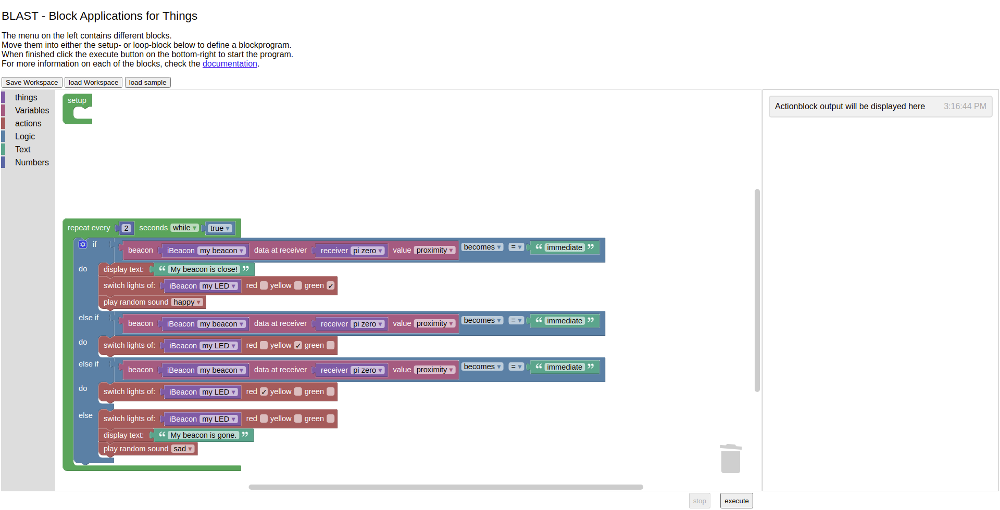
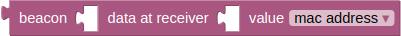
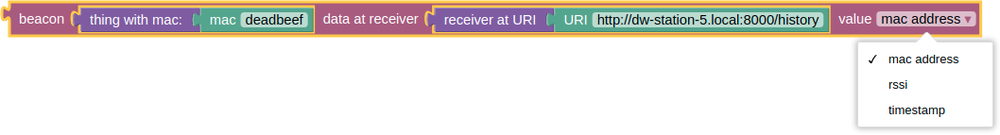
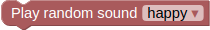
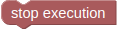

# BLAST Documentation<!-- omit in toc -->

BLAST is an acronym for **Bl**ock **A**pplication**s** for **t**hings. It offers a web-based, visual programming environment based on Google's [Blockly](https://developers.google.com/blockly). 

In order to build and run a block-program, users can drag blocks together and then execute those by clicking the `execute` button on the bottom right. To stop a running program, click the `stop` button next to it.




The following describes the BLAST blocks in detail.

In BLAST there are 5 categories of blocks:

* **program**: The setup- and repeat-block control the block programs process order
* **things**: Blocks representing and retrieving data from things
* **actions**: Display measured data, custom messages or setting the LEDs of a signal light
* **logic**: Everything concerning boolean logic, like if, if-else blocks and events
* **text**: Text creation and manipulation blocks
* **numbers**: represent numbers and enable basic arithmetic

For a formal syntax definition check the first section [1. syntax](#1-Syntax) and to learn about the blocks semantic see [2. semantics](#2-Semantics).

# Contents:<!-- omit in toc -->
- [1. Syntax](#1-syntax)
  - [1.1. Extended Backus-Naur Form](#11-extended-backus-naur-form)
  - [1.2. block syntax](#12-block-syntax)
    - [1.2.1. program-blocks syntax](#121-program-blocks-syntax)
      - [1.2.1.1. setup-syntax](#1211-setup-syntax)
      - [1.2.1.2. repeat-syntax](#1212-repeat-syntax)
    - [1.2.2. things-blocks syntax](#122-things-blocks-syntax)
      - [1.2.2.1. iBeacon-syntax](#1221-ibeacon-syntax)
      - [1.2.2.2. receiver-syntax](#1222-receiver-syntax)
      - [1.2.2.3. iBeacon-data](#1223-ibeacon-data)
    - [1.2.3. action blocks syntax](#123-action-blocks-syntax)
      - [1.2.3.1. display text syntax](#1231-display-text-syntax)
      - [1.2.3.2. display data syntax](#1232-display-data-syntax)
      - [1.2.3.3. switch lights syntax](#1233-switch-lights-syntax)
      - [1.2.3.4. random sound syntax](#1234-random-sound-syntax)
      - [1.2.3.5. halt syntax](#1235-halt-syntax)
    - [1.2.4. logic blocks syntax](#124-logic-blocks-syntax)
      - [1.2.4.1. boolean-value syntax](#1241-boolean-value-syntax)
      - [1.2.4.2. comparison syntax](#1242-comparison-syntax)
      - [1.2.4.3. logical operation syntax](#1243-logical-operation-syntax)
      - [1.2.4.4. not syntax](#1244-not-syntax)
      - [1.2.4.5. if / if-else syntax](#1245-if--if-else-syntax)
      - [1.2.4.6. event syntax](#1246-event-syntax)
    - [1.2.5. text blocks syntax](#125-text-blocks-syntax)
      - [1.2.5.1. text-value syntax](#1251-text-value-syntax)
      - [1.2.5.2. text concatenation syntax](#1252-text-concatenation-syntax)
    - [1.2.6. number blocks syntax](#126-number-blocks-syntax)
      - [1.2.6.1. number-value syntax](#1261-number-value-syntax)
      - [1.2.6.2. infinity syntax](#1262-infinity-syntax)
      - [1.2.6.3. arithmetic operations syntax](#1263-arithmetic-operations-syntax)
      - [1.2.6.4. random integer syntax](#1264-random-integer-syntax)
- [2. Semantics](#2-semantics)
  - [2.1. functions](#21-functions)
    - [2.1.1. runCode](#211-runcode)
    - [2.1.2. getAllAddresses](#212-getalladdresses)
    - [2.1.3. queryAlliBeacons](#213-queryallibeacons)
    - [2.1.4. stopCode](#214-stopcode)
    - [2.1.5. displayTable](#215-displaytable)
    - [2.1.6. switchLights](#216-switchlights)
    - [2.1.7. insertMessage](#217-insertmessage)
    - [2.1.8. playRandomSoundFromCategory](#218-playrandomsoundfromcategory)
  - [2.2. block semantics](#22-block-semantics)
    - [2.2.1. program-blocks semantics](#221-program-blocks-semantics)
      - [2.2.1.1. setup semantics](#2211-setup-semantics)
      - [2.2.1.2. repeat semantics](#2212-repeat-semantics)
    - [2.2.2. things-blocks semantics](#222-things-blocks-semantics)
      - [2.2.2.1. iBeacon semantics](#2221-ibeacon-semantics)
      - [2.2.2.2. receiver semantics](#2222-receiver-semantics)
      - [2.2.2.3. iBeacon-data semantics](#2223-ibeacon-data-semantics)
    - [2.2.3. action blocks semantics](#223-action-blocks-semantics)
      - [2.2.3.1. display text semantics](#2231-display-text-semantics)
      - [2.2.3.2. display data semantics](#2232-display-data-semantics)
      - [2.2.3.3. switch lights semantics](#2233-switch-lights-semantics)
      - [2.2.3.4. random sound semantics](#2234-random-sound-semantics)
      - [2.2.3.5. halt semantics](#2235-halt-semantics)
    - [2.2.4. logic blocks semantics](#224-logic-blocks-semantics)
      - [2.2.4.1. boolean-value semantics](#2241-boolean-value-semantics)
      - [2.2.4.2. comparison semantics](#2242-comparison-semantics)
      - [2.2.4.3. logical operation semantics](#2243-logical-operation-semantics)
      - [2.2.4.4. not semantics](#2244-not-semantics)
      - [2.2.4.5. if / if-else semantics](#2245-if--if-else-semantics)
      - [2.2.4.6. event semantics](#2246-event-semantics)
    - [2.2.5. text blocks semantics](#225-text-blocks-semantics)
      - [2.2.5.1. text-value semantics](#2251-text-value-semantics)
      - [2.2.5.2. text concatenation semantics](#2252-text-concatenation-semantics)
    - [2.2.6. number blocks semantics](#226-number-blocks-semantics)
      - [2.2.6.1. number-value semantics](#2261-number-value-semantics)
      - [2.2.6.2. infinity semantics](#2262-infinity-semantics)
      - [2.2.6.3. arithmetic operations semantics](#2263-arithmetic-operations-semantics)
      - [2.2.6.4. random integer semantics](#2264-random-integer-semantics)


# 1. Syntax

This section gives an overview of the syntax used in BLAST

## 1.1. Extended Backus-Naur Form

The following describes BLAST's syntax using the [W3C EBNF Notation](https://www.w3.org/TR/2010/REC-xquery-20101214/#EBNFNotation).

**block programs**<a name="ebnf-block-programs"></a>

<pre>
<a name="ebnf-block-program"></a>block-program            ::= (<a href="#ebnf-setup">setup</a> <a href="#ebnf-repeat">repeat</a>)
<a name="ebnf-setup"></a>setup                    ::= ( <a href="#ebnf-action">action</a> | <a href="#ebnf-conditional-statement">conditional-statement</a> )*
<a name="ebnf-repeat"></a>repeat                     ::= <a href="#ebnf-number">number</a> <a href="#ebnf-number">number</a> ( <a href="#ebnf-ebnf-action">action</a> | <a href="#ebnf-conditional-statement">conditional-statement</a> )*
<a name="ebnf-conditional-statement"></a>conditional-statement    ::= ( <a href="#ebnf-if">if</a> | <a href="#ebnf-if-else">if-else</a> )
</pre>

**things blocks**<a name="ebnf-things-blocks"></a>
<pre>
<a name="ebnf-iBeacon-data"></a>iBeacon-data             ::= "resultsMap.get('" <a href="#ebnf-receiver">receiver</a> "').get('" <a href="#ebnf-iBeacon">iBeacon</a> "')[" <a href="#ebnf-iBeacon-data-dropdown">iBeacon-data-dropdown</a> "].value
<a name="ebnf-iBeacon-dropdown"></a>iBeacon-data-dropdown    ::= "mac address", "rssi", "proximity", "timestamp", "measured power", "accuracy", "major", "minor"
<a name="ebnf-iBeacon"></a>iBeacon                  ::= <a href="#ebnf-iBeaconObject">iBeaconObject</a>
<a name="ebnf-receiver"></a>receiver                 ::= <a href="#ebnf-receiverObject">receiverObject</a>
<a name="ebnf-iBeaconObject"></a>iBeaconObject            ::= <a href="#ebnf-StringLiteral">StringLiteral</a>
<a name="ebnf-receiverObject"></a>receiverObject           ::= <a href="#ebnf-StringLiteral">StringLiteral</a>
</pre>

**action blocks**<a name="ebnf-action-blocks"></a>
<pre>
<a name="ebnf-action"></a>action                   ::= ( <a href="#ebnf-display-text">display-text</a> | <a href="#ebnf-display-data">display-data</a> | <a href="#ebnf-switch-lights">switch-lights</a> | <a href="#ebnf-playsound">play-sound</a> | <a href="#ebnf-halt">halt</a>)
display-text             ::= "displayText(" (<a href="#ebnf-text">text</a> | <a href="#ebnf-number">number</a> | <a href="#ebnf-iBeacon-data">iBeacon-data</a>) ");"
display-data             ::= "displayData(" <a href="#ebnf-iBeacon">iBeacon</a> "," <a href="#ebnf-receiver">receiver</a> "," <a href="#ebnf-boolean-array">boolean-array</a> ");"
switch-lights            ::= "switch-lights(" <a href="#ebnf-iBeacon">iBeacon</a> "," <a href="#ebnf-BooleanLiteral">BooleanLiteral</a> "," <a href="#ebnf-BooleanLiteral">BooleanLiteral</a> "," <a href="#ebnf-BooleanLiteral">BooleanLiteral</a> ");"
play-sound               ::= "playRandomSoundFromCategory(category);"
halt                     ::= "stopCode('halted');"
</pre>

**text blocks**<a name="ebnf-text-blocks"></a>
<pre>
<a name="ebnf-text"></a>text                     ::= ( <a href="#ebnf-text-value">text-value</a> | <a href="#ebnf-text-concat">text-concat</a>)
<a name="ebnf-text-value"></a>text-value               ::= <a href="#ebnf-StringLiteral">StringLiteral</a>
<a name="ebnf-text-concat"></a>text-concat              ::= <a href="#ebnf-text">text</a> (<a href="#ebnf-text">text</a>)*
</pre>


**number blocks**<a name="ebnf-number-blocks"></a>
<pre>
<a name="ebnf-number"></a>number                   ::= ( <a href="#ebnf-number-value">number-value</a> | <a href="#ebnf-number-infinity">number-infinity</a> | <a href="#ebnf-arithmetic-operations">arithmetic-operations</a> | <a href="#ebnf-number-random">number-random</a> )
<a name="ebnf-number-value"></a>number-value             ::= <a href="#ebnf-DoubleLiteral">DoubleLiteral</a>
<a name="ebnf-infinity"></a>number-infinity          ::= <a href="#ebnf-DoubleLiteral">DoubleLiteral</a>
<a name="ebnf-arithmeti-operations"></a>arithmetic-operations    ::= <a href="#ebnf-number">number</a> <a href="#ebnf-number">number</a>
<a name="ebnf-number-random"></a>number-random            ::= <a href="#ebnf-number">number</a> <a href="#ebnf-number">number</a>
</pre>

**logic blocks**<a name="ebnf-logic-blocks"></a>
<pre>
<a name="ebnf-if"></a>if                       ::= <a href="#ebnf-boolean">boolean</a> ( <a href="#ebnf-action">action</a> | <a href="#ebnf-conditional-statement">conditional-statement</a> )*
<a name="ebnf-if-else"></a>if-else                  ::= <a href="#ebnf-boolean">boolean</a> ( <a href="#ebnf-action">action</a> | <a href="#ebnf-conditional-statement">conditional-statement</a> )*
<a name="ebnf-boolean"></a>boolean                  ::= ( <a href="#ebnf-boolean-value">boolean-value</a> | <a href="#ebnf-comparison">comparison</a> | <a href="#ebnf-logical-comparison">logical-operation</a> | <a href="#ebnf-not">not</a> )
<a name="ebnf-boolean-array"></a>boolean-array            ::= "[" (<a href="#ebnf-BooleanLiteral">BooleanLiteral</a> ( "," <a href="#ebnf-BooleanLiteral">BooleanLiteral</a>  )* )? "]"
<a name="ebnf-boolean-value"></a>boolean-value            ::= <a href="#ebnf-booleanLiteral">booleanLiteral</a>
<a name="ebnf-comparison"></a>comparison               ::= (<a href="#ebnf-number">number</a> | <a href="#ebnf-text">text</a> ) (<a href="#ebnf-number">number</a> | <a href="#ebnf-text">text</a> )
<a name="ebnf-logical-comparison"></a>logical-operation        ::= <a href="#ebnf-boolean">boolean</a> <a href="#ebnf-boolean">boolean</a>
<a name="ebnf-not"></a>not                      ::= <a href="#ebnf-boolean">boolean</a>
</pre>

**Literals**<a name="ebnf-literals"></a>
<pre>
<a name="ebnf-StringLiteral"></a>StringLiteral            ::= /* any visible character and the white-space character, no termination characters */
<a name="ebnf-DoubleLiteral"></a>DoubleLiteral            ::= (("." <a href="#ebnf-Digits">Digits</a>) | (<a href="#ebnf-Digits">Digits</a> ("." [0-9]*)?)) [eE] [+-]? <a href="#ebnf-Digits">Digits</a>
<a name="ebnf-Digits"></a>Digits                   ::= [0-9]+
<a name="ebnf-BooleanLiteral"></a>BooleanLiteral           ::= true | false
</pre>

## 1.2. block syntax

### 1.2.1. program-blocks syntax

#### 1.2.1.1. setup-syntax


**input:** *action* or *conditional statement*  
**output:** *no output*

#### 1.2.1.2. repeat-syntax


**input:** *number* *number*  
**output:** *no output*

### 1.2.2. things-blocks syntax

There are 3 different blocks in this category: **iBeacon**, **receiver** and **iBeacon-data**.

#### 1.2.2.1. iBeacon-syntax


**input:** *no input*  
**output:** *iBeaconObject*

#### 1.2.2.2. receiver-syntax


**input:** *no input*  
**output:** *receiverObject*

#### 1.2.2.3. iBeacon-data


**input:** *thing*  *receiver*  
**output:** *string* | *number* - the retrieved data

### 1.2.3. action blocks syntax

There are 5 different blocks in this category: **display text**, **display data**, **switch lights**, **random sound** and **halt**

#### 1.2.3.1. display text syntax


**input:** *text* | *number*  
**output:** *no output*

#### 1.2.3.2. display data syntax


**input:** *receiver*  
**output:** *no output*

#### 1.2.3.3. switch lights syntax


**input:** *iBeacon*  
**output:** *no output*

#### 1.2.3.4. random sound syntax


**input:** *no input*
**output:** *no output*

#### 1.2.3.5. halt syntax


**input:** *no input*
**output:** *no output*


### 1.2.4. logic blocks syntax

#### 1.2.4.1. boolean-value syntax


**input:** *no input*  
**output:** *boolean*


#### 1.2.4.2. comparison syntax


**input:** (*text* | *number*), (*text* | *number*)  
**output:** *boolean*

#### 1.2.4.3. logical operation syntax


**input:** *boolean*, *boolean*  
**output:** *boolean*

#### 1.2.4.4. not syntax


**input:** *boolean*  
**output:** *boolean*

#### 1.2.4.5. if / if-else syntax


**input:** *boolean* (*action* | *conditional-statement*)*
**output:** *conditional-statement*

#### 1.2.4.6. event syntax
)

**input:** *iBeaconObject* ( *text* | *number* )  
**output:** *boolean*

### 1.2.5. text blocks syntax

#### 1.2.5.1. text-value syntax


**input:** *no input*  
**output:** *text*

#### 1.2.5.2. text concatenation syntax


**input:** { *text* }  
**output** *text*

### 1.2.6. number blocks syntax

#### 1.2.6.1. number-value syntax


**input:** *no input*  
**output:** *number*

#### 1.2.6.2. infinity syntax


**input:** *no input*  
**output:** *number*

#### 1.2.6.3. arithmetic operations syntax


**input:** *number* *number*  
**output:** *number*

#### 1.2.6.4. random integer syntax


**input:** *number* *number*  
**output:** *number*


# 2. Semantics

This section explains what happens when a block program gets executed. In order to do so the first section lists and explains all static helper functions of BLAST and the second section describes each block in detail.

Click the links below to jump to each one of those sections.
* [**functions**](#21-functions)
* [**blocks**](#22-block-semantics)

## 2.1. functions
BLAST's has a handful of predefined functions in order to execute block programs. These functions can be divided into the tow categories *general* and *specific*. 

The *general* functions perform tasks used by the BLAST environment to handle execution of a block program. The *specific* functions are only used by single blocks and are not needed for execution of a block program without these blocks.

The following describes all functions used by BLAST and it's blocks.

**general functions:**

* [**runcode**](#runCode)
* [**getAllAddresses**](#getAllAddresses)
* [**queryAlliBeacons**](#queryAlliBeacons)
* [**stopCode**](#stopcode)

**specific functions:**

* [**displayTable**](#displayTable)
* [**insertMessage**](#insertMessage)
* [**playRandomSoundFromCategory**](#playRandomSoundFromCategory)

**[sc-ble-adapter](https://github.com/wintechis/sc-ble-adapter/) only functions**
* [**switchLights**](#switchLights)
  
When a user clicks the execute button the [**runCode()**](#runCode) function is called.

### 2.1.1. runCode

The `runCode()` handles execution of a block program.

Before each iteration of any of the **program blocks**, **setup** and **repeat**, it uses the [**getAllAddresses()**](#212-getalladdresses) function to collect addresses of all resources and then [**queryAlliBeacons()**](#213-queryallibeacons) to query those addresses and store the results. Descriptions of theses functions can be found in their respective section.

**parameters:** *none*  
**returns:** `null`

``` JavaScript
runCode = function() {
    // disable run button and enable stop button
    document.getElementById("stop").disabled = false;
    document.getElementById("run").disabled = true;
    document.getElementById("status").innerHTML = "running... ";

    // stop loop interval
    var prevInterval = interval;
    clearInterval(prevInterval);

    // clear process arrays
    var setup = [];
    var loop = []

    // query data first
    var addresses = getAllAddresses();
    queryAlliBeacons(addresses).then(() => {
        var code = Blockly.JavaScript.workspaceToCode(workspace);

        console.log(code);

        // pushes the block's code into either setup or loop array 
        eval(code);

        // eval setup
        for (process of setup) {
            eval(process);
        }

        prevResultsMap = new Map(resultsMap);

        //eval loop
        var setupBlock = workspace.getBlockById("setup");
        var addresses = getiBeaconAddressesInBlock(setupBlock);

        // stop condition
        if (!eval(loopCondition)) {
            stopCode('finished');
            return;
        }

        // first iteration
        for (process of loop) {
            eval(process);
        }

        // repeat after n seconds
        interval = setInterval(function() {

            var addresses = getAllAddresses();
            queryAlliBeacons(addresses).then(() => {
                if (!eval(loopCondition)) {
                    stopCode('finished');
                    return;
                }

                for (process of loop) {
                    eval(process);
                }
            });

            prevResultsMap = new Map(resultsMap);
        }, loopTime * 1000)
    })
}
```

### 2.1.2. getAllAddresses

Before executing a block program, BLAST uses `getAllAddresses()` to parse the workspace for **receiver** blocks and saves their addresses.

**parameters:** *none*  
**returns:** `addresses` (*string[]*) array with addresses of receivers

``` JavaScript
getAllAddresses = function() {
    let receivers = workspace.getBlocksByType("receiver_get");
    var addresses = []
    receivers.forEach(block => {
        if (block.type != 'receiver_get') return;
        var thingName = block.getFieldValue('thing');
        var thing = Blockly.Things.thingsMap.receiver[thingName];
        addresses.push(thing.address);
    })
    addresses = eliminateDupilactes(addresses);
    return addresses;
}
```

This enables parsing their RDF before each iteration of a program block, by calling `queryAlliBeacons(addresses)` . 

### 2.1.3. queryAlliBeacons

This function uses [µRDF](https://github.com/vcharpenay/uRDF.js) to query a resource with a predefined SPARQL query and stores the results into a JavaScript Map, enabling blocks to perform JavaScript operations like selecting properties and comparing values of the retrieved data.

**parameters:** 

| parameter   | type       | description                       |
|-------------|------------|-----------------------------------|
| `addresses` | *string[]* | array with addresses of receivers |

**returns:** Promise (*Promise*) empty Promise Object

``` JavaScript
function queryAlliBeacons(addresses) {
    return new Promise((resolve, reject) => {
        if (addresses.length == 0) {
            resolve();
        }
        return Promise.all(addresses.map(address => {
            var url = new URL(address);
            var baseUrl = url.protocol + "//" + url.host;
            var path = url.pathname;

            var query =
                `BASE <${baseUrl}>
        PREFIX scp: <https://github.com/aharth/supercool/>
        PREFIX sosa: <http://www.w3.org/ns/sosa/>
        PREFIX qudt: <http://qudt.org/1.1/schema/qudt#>
        
        SELECT ?ap ?mac ?rssi ?resultTime ?accuracy ?major ?minor ?measuredPower ?proximity
        FROM <${path}>
        WHERE 
        {
            ?ble sosa:madeBySensor ?apfull .
            BIND(substr(?apfull, 7,1) AS ?ap) .
            ?ble sosa:hasResult ?sensor .
            ?sensor scp:MacAddress ?mac .
            ?sensor qudt:numericValue ?rssi .
            ?sensor sosa:resultTime ?resultTime .
            ?sensor scp:accuracy ?accuracy .
            ?sensor scp:major ?major .
            ?sensor scp:major ?minor .
            ?sensor scp:measuredPower ?measuredPower .
            ?sensor scp:proximity ?proximity .
        } ORDER BY ?ap ?mac`;

            urdf.clear();
            urdf.query(query)
                .then(result => {
                    let formattedResult = new Map();
                    for (r of result) {
                        formattedResult.set(r.mac.value, r);
                    }
                    resultsMap.set(address, formattedResult);
                    resolve();
                })
        }));
    });
}
```

Before each iteration of the **repeat** block if `resultsMap` is not empty BLAST will save a copy of it to enable the **event**#event block to compare values from `resultsMap` with values from previous Results.

### 2.1.4. stopCode

The `stopCode` function stops the execution of a block-program.  
`message` will be displayed next to the stop button.

**parameters:** *none*  
**returns:** `null`

``` JavaScript
stopCode = function(message) {
    // enable run button and disable stop button
    document.getElementById("stop").disabled = true;
    document.getElementById("run").disabled = false;

    // stop interval execution and set status text
    clearInterval(interval)
    document.getElementById("status").innerHTML = message;
}
```

### 2.1.5. displayTable

This helper function creates an HTML table listing iBeacon data. 

**parameters:**

| parameter    | type        | description                           |
|--------------|-------------|---------------------------------------|
| `key` | *string*    | key of the iBeacon data in resultsMap |
| `checkboxes` | *boolean[]* | defines which columns to display      |

**returns:** `null`

``` JavaScript
function displayTable(key, checkboxes) {

    let resultsField = document.createElement("table");

    // deal with missing values
    results = resultsMap.get(key);
    let vars = checkboxes;

    let html = '<tr>';
    vars.forEach(v => html += '<th>' + v + '</th>');
    html += '</tr>';

    results.forEach(res => {
        html += '<tr>';
        vars.forEach(v => {
            html += '<td>' + (res[v] ? res[v].value : '') + '</td>'
        });
        html += '</tr>';
    });

    resultsField.innerHTML = html;

    var div = document.getElementById("messageBox");
    div.insertBefore(resultsField, div.firstChild);
}
```

### 2.1.6. switchLights

SwitchLights is a helper function, used by the [**switch lights**](#216-switchlights) block. It sends a HTTP-POST request to the [sc-ble-adapter](https://github.com/wintechis/sc-ble-adapter/) which controls the [LED strip controller](https://github.com/arduino12/ble_rgb_led_strip_controller) specified by `mac` .

**parameters:**

| parameter | type      | description                        |
|-----------|-----------|------------------------------------|
| `address` | *string*  | the LED controllers http interface |
| `r` | *boolean* | turns red led on or off            |
| `y` | *boolean* | turns yellow led on or off         |
| `g` | *boolean* | turns green led on or off          |

**returns:** `null`

``` JavaScript
function switchLights(address, r, y, g) {
    var r_byte = r ? "ff" : "00";
    var y_byte = y ? "ff" : "00";
    var g_byte = g ? "ff" : "00";

    var data = {
        type: "WriteWithoutResponse",
        data: "7e000503" + r_byte + g_byte + y_byte + "00ef"
    };

    fetch("http://raspberrypi.local:8000/devices/be5860006ad4/char/0009/", {
        method: "POST",
        headers: new Headers({
            "Content-Type": "application/json"
        }),
        body: JSON.stringify(data)
    }).then(res => {
        console.log("Request complete! response:", res);
    })
}
```

### 2.1.7. insertMessage

insertMessage is a helper function used by the **display text** block. It creates a HTML div with the desired text and attaches it to the action block output container.

**parameters:** 

| parameter | type     | description     |
|-----------|----------|-----------------|
| text      | *string* | text to display |

**returns:** `null`

``` JavaScript
function insertMessage(text) {
    msg = document.createElement("div");
    msg.classList.add("message");
    msg.id = "message-" + messageCounter;

    textNode = document.createTextNode(text);
    msg.appendChild(textNode);

    timeSpan = document.createElement("span");
    timeSpan.classList.add("time");
    timeSpan.innerHTML = new Date().toLocaleTimeString();
    msg.appendChild(timeSpan);

    msgBox = document.getElementById("messageBox");
    msgBox.insertBefore(msg, msgBox.firstChild);
}
```

### 2.1.8. playRandomSoundFromCategory
This functions is used by the **random sound** block. It plays a random audio file out of two predefined arrays `soundsCheerful` and `soundsSad`.

**parameters:** 

| parameter | type     | description     |
|-----------|----------|-----------------|
| text      | *string* | identifier for the sound array |

**returns:** `null`

```JavaScript
function playRandomSoundFromCategory(category){
    var soundArray;
    switch (category) {
        case "happy":
            soundArray = soundsCheerful;
            break;
        case "sad":
            soundArray = soundsSad;
            break;
    }
    var index = Math.random() * soundArray.length | 0;
    soundArray[index].play();
}
```

## 2.2. block semantics

### 2.2.1. program-blocks semantics

The **setup** and **repeat** blocks control the block programs process order.

#### 2.2.1.1. setup semantics

Every block in the setup-block get's executed once at program start.

To run the blocks in the setup block consecutively the block pushes its containing blocks into an array.

``` JavaScript
var code = `setup.push(\`${statements_onstart.trim()}\`);`;
```

#### 2.2.1.2. repeat semantics

The blocks withing the repeat-block are executed consecutively `n` -times every `x` seconds according to the parameters .

Like with the **setup** block, RDF-data is queried before each execution of the **repeat** block. Then the blocks within the **repeat** block are executed consecutively.  
Additionally the **repeat** block writes each data retrieved from the RDF-graphs to a map to store previous results. This map ( `prevResultsMap` ) is used by the **event** block to compare previous and current results.

``` JavaScript
if(dropdown_dropdown_mode == "mode_until"){
    value_condition = "!" + value_condition
}

var code = `loop.push(\`${statements_loop.trim()}\`); var loopTime = ${value_seconds}; var loopCondition = ${value_condition};`;
return code;
```

### 2.2.2. things-blocks semantics

There are 3 different blocks in this category: **iBeacon**, **receiver** and **iBeacon-data**.

#### 2.2.2.1. iBeacon semantics

The iBeacon block represents an iBeacon

to create a new iBeacon click the `create new thing` button in the things category.  
Internally, this stores the address of the iBeacon's RDF-graph in a map.

On execution the iBeacon block then retrieves the address of the iBeacon's RDF-graph from this map.

``` JavaScript
return thing.address.trim();
```

#### 2.2.2.2. receiver semantics

The receiver block represents a Bluetooth receiver.

to create a new receiver click the `create new receiver` button in the things category.
Internally, this stores the address of the receiver's RDF-graph in a map.

On execution the receiver block then retrieves the address of the receivers's RDF-graph from this map.

``` JavaScript
return thing.address.trim();
```

#### 2.2.2.3. iBeacon-data semantics

The iBeacon-data block retrieves iBeacon data.

Data is retrieved from the results map created on execution of the setup- or repeat-block. (See [runcode](#211-runcode))

``` JavaScript
var code = `resultsMap.get("${receiver}").get("${iBeacon}")["${value}"].value`;
return code;
```

### 2.2.3. action blocks semantics

There are 3 different blocks in this category: **display text**, **display data** and **switch lights**. 

#### 2.2.3.1. display text semantics

The display text block adds a text container to the action-block output container on the right.

This block calls the [insertMessage](#217-insertmessage) function to insert it's input into a message container in the action-block-output container.

``` JavaScript
var code = `insertMessage(${text_msg})\n`;
return code;
```

#### 2.2.3.2. display data semantics

The display data block prints a table containing all the data received at a receiver to the action-block output container on the right.

When executed this block writes the check-box values into an array and calls the [displayTable](#215-displaytable) function.

``` JavaScript
// checkboxes are booleans for {showRSSI, showResultTime, showAccuracy, 
//  showMajor, showMinor, showMeasuredPower, showProximity}
checkboxes = ["mac"];
if (checkbox_show_rssi) checkboxes.push("rssi");
if (checkbox_show_proximity) checkboxes.push("proximity");
if (checkbox_timestamp) checkboxes.push("resultTime");
if (checkbox_show_measured_power) checkboxes.push("measuredPower");
if (checkbox_show_accuracy) checkboxes.push("accuracy");
if (checkbox_show_major) checkboxes.push("major");
if (checkbox_show_minor) checkboxes.push("minor");

code = `displayTable("${value_thing}", ['${checkboxes.join("','")}']);`;
return code;
```

#### 2.2.3.3. switch lights semantics

The switch lights block can be used to control the LEDs of a [LED strip controller](https://github.com/arduino12/ble_rgb_led_strip_controller).

This block calls the [switchLights](#216-switchlights) function, which then sends a HTTP-POST request to the [sc-ble-adapter](https://github.com/wintechis/sc-ble-adapter/) in order to controls the [LED strip controller](https://github.com/arduino12/ble_rgb_led_strip_controller) specified by `mac` .

``` JavaScript
var code = `switchLights("${iBeacon}", ${cb_red}, ${cb_yellow}, ${cb_green});`;
return code;
```

#### 2.2.3.4. random sound semantics
This block plays a random sound out of the two predefined sound-sets "happy" and "sad" by calling the [playRandomSoundFromCategory](#218-playrandomsoundfromcategory)function.

```JavaScript
var code = `playRandomSoundFromCategory("${dropdown_category}");\n`;
return code;
```
#### 2.2.3.5. halt semantics
The halt block stops execution of the current block program, by calling the [stopCode](#214-stopcode) function.

```JavaScript
var code = 'stopCode("finished");\n';
return code;
```


### 2.2.4. logic blocks semantics

Logic blocks are used to implement [boolean logic](https://en.wikipedia.org/wiki/Boolean_algebra).  

If a block expects a Boolean value as an input, it usually interprets an absent input as **false**. Non-Boolean values cannot be directly plugged in where Boolean values are expected.

#### 2.2.4.1. boolean-value semantics

The value block represents a boolean value

This block returns `true` or `false` depending on the value selected from the dropdown.

``` JavaScript
var code = (block.getFieldValue('BOOL') == 'TRUE') ? 'true' : 'false';
return [code, Blockly.JavaScript.ORDER_ATOMIC];
```

#### 2.2.4.2. comparison semantics

There are six comparison operators. Each takes two inputs and returns true or false depending on how the inputs compare with each other.

The six operators are: equals, not equals, less than, greater than, less than or equal, greater than or equal.

On execution this block returns JavaScript code, that compares two values when evaluated.

``` JavaScript
// Comparison operator.
var OPERATORS = {
    'EQ': '==',
    'NEQ': '!=',
    'LT': '<',
    'LTE': '<=',
    'GT': '>',
    'GTE': '>='
};
var operator = OPERATORS[block.getFieldValue('OP')];
var order = (operator == '==' || operator == '!=') ?
    Blockly.JavaScript.ORDER_EQUALITY : Blockly.JavaScript.ORDER_RELATIONAL;
var argument0 = Blockly.JavaScript.valueToCode(block, 'A', order) || '0';
var argument1 = Blockly.JavaScript.valueToCode(block, 'B', order) || '0';
var code = argument0 + ' ' + operator + ' ' + argument1;
return [code, order];
```

#### 2.2.4.3. logical operation semantics

This block represents the logical operations *and* and *or*.

On execution this block returns JavaScript code, that performs the logic operation selected in the dropdown when evaluated.

``` JavaScript
// Operations 'and', 'or'.
var operator = (block.getFieldValue('OP') == 'AND') ? '&&' : '||';
var order = (operator == '&&') ? Blockly.JavaScript.ORDER_LOGICAL_AND :
    Blockly.JavaScript.ORDER_LOGICAL_OR;
var argument0 = Blockly.JavaScript.valueToCode(block, 'A', order);
var argument1 = Blockly.JavaScript.valueToCode(block, 'B', order);
if (!argument0 && !argument1) {
    // If there are no arguments, then the return value is false.
    argument0 = 'false';
    argument1 = 'false';
} else {
    // Single missing arguments have no effect on the return value.
    var defaultArgument = (operator == '&&') ? 'true' : 'false';
    if (!argument0) {
        argument0 = defaultArgument;
    }
    if (!argument1) {
        argument1 = defaultArgument;
    }
}
var code = argument0 + ' ' + operator + ' ' + argument1;
return [code, order];
```

#### 2.2.4.4. not semantics

The not block converts its Boolean input into its opposite. For example, the result of:  

 

is **false**


The not-block calls a function that negates the boolean in the argument.

``` JavaScript
// Negation.
var order = Blockly.JavaScript.ORDER_LOGICAL_NOT;
var argument0 = Blockly.JavaScript.valueToCode(block, 'BOOL', order) ||
    'true';
var code = '!' + argument0;
return [code, order];
```

#### 2.2.4.5. if / if-else semantics

The simplest conditional statement is an **if** block, as shown:


When run, this will compare the RSSI value of the thing **my beacon** to -30. If it is larger, "Beacon is close!" will be displayed. Otherwise, nothing happens.

It is also possible to specify that something should happen if the condition is *not* true, as shown in this example:


As with the previous block, "Beacon is close!" will be displayed if the RSSI value of **my beacon** > -30; otherwise, "Beacon is not very close." will be displayed.
An **if** block may have zero or one **else** sections but not more than one.

The underlying function, which is called upon execution returns the JavaScript representation of the if condition defined by the block.

``` JavaScript
Blockly.JavaScript['controls_if'] = function(block) {
    // If/elseif/else condition.
    var n = 0;
    var code = '',
        branchCode, conditionCode;
    if (Blockly.JavaScript.STATEMENT_PREFIX) {
        // Automatic prefix insertion is switched off for this block.  Add manually.
        code += Blockly.JavaScript.injectId(Blockly.JavaScript.STATEMENT_PREFIX,
            block);
    }
    do {
        conditionCode = Blockly.JavaScript.valueToCode(block, 'IF' + n,
            Blockly.JavaScript.ORDER_NONE) || 'false';
        branchCode = Blockly.JavaScript.statementToCode(block, 'DO' + n);
        if (Blockly.JavaScript.STATEMENT_SUFFIX) {
            branchCode = Blockly.JavaScript.prefixLines(
                Blockly.JavaScript.injectId(Blockly.JavaScript.STATEMENT_SUFFIX,
                    block), Blockly.JavaScript.INDENT) + branchCode;
        }
        code += (n > 0 ? ' else ' : '') +
            'if (' + conditionCode + ') {\n' + branchCode + '}';
        ++n;
    } while (block.getInput('IF' + n));

    if (block.getInput('ELSE') || Blockly.JavaScript.STATEMENT_SUFFIX) {
        branchCode = Blockly.JavaScript.statementToCode(block, 'ELSE');
        if (Blockly.JavaScript.STATEMENT_SUFFIX) {
            branchCode = Blockly.JavaScript.prefixLines(
                Blockly.JavaScript.injectId(Blockly.JavaScript.STATEMENT_SUFFIX,
                    block), Blockly.JavaScript.INDENT) + branchCode;
        }
        code += ' else {\n' + branchCode + '}';
    }
    return code + '\n';
};
```

#### 2.2.4.6. event semantics

The event block is used to describe events.  
iE it returns `true` or `false` when a measurement enters or leaves a specified range.

This block creates JavaScript code, that when evaluated compares the specified measurement's current result with the previous one. Those results are gathered when executing the **setup** and **repeat** blocks.

``` JavaScript
var order = (operator == '==' || operator == '!=') ?
    Blockly.JavaScript.ORDER_EQUALITY : Blockly.JavaScript.ORDER_RELATIONAL;

var negate = dropdown_startstop == "BECOMES" ? "" : "!";

var code =
    `${negate}(!(prevResultsMap.get("${receiver}").get("${iBeacon}")["${value}"].value ${operator} ${value_name})) &&
${negate} (resultsMap.get("${receiver}").get("${iBeacon}")["${value}"].value ${operator} ${value_name})`;

return [code, Blockly.JavaScript.ORDER_NONE];
```

### 2.2.5. text blocks semantics

Examples of pieces of text are:

* "thing #1"
* "March 12, 2010"
* "" (the empty text)

Text can contain letters (which may be lower-case or upper-case), numbers, punctuation marks, other symbols, and blank spaces between words.

#### 2.2.5.1. text-value semantics

The following block creates the piece of text "hello".

When executed this block simply returns the entered text as a JavaScript string.

``` JavaScript
var code = Blockly.JavaScript.quote_(block.getFieldValue('TEXT'));
return [code, Blockly.JavaScript.ORDER_ATOMIC];
```

#### 2.2.5.2. text concatenation semantics

The text concatenation block combines (concatenates) the value of two or more text blocks.

To increase the number of text inputs, click on the gear icon, which changes the view to:


Additional inputs are added by dragging an "item" block from the gray toolbox on the left into the "join" block.

In order to concatenate strings this block adds all values to an array and then calls the JavaScript function `join()` on that array.

``` JavaScript
switch (block.itemCount_) {
    case 0:
        return ['\'\'', Blockly.JavaScript.ORDER_ATOMIC];
    case 1:
        var element = Blockly.JavaScript.valueToCode(block, 'ADD0',
            Blockly.JavaScript.ORDER_NONE) || '\'\'';
        var code = Blockly.JavaScript.text.forceString_(element);
        return [code, Blockly.JavaScript.ORDER_FUNCTION_CALL];
    case 2:
        var element0 = Blockly.JavaScript.valueToCode(block, 'ADD0',
            Blockly.JavaScript.ORDER_NONE) || '\'\'';
        var element1 = Blockly.JavaScript.valueToCode(block, 'ADD1',
            Blockly.JavaScript.ORDER_NONE) || '\'\'';
        var code = Blockly.JavaScript.text.forceString_(element0) + ' + ' +
            Blockly.JavaScript.text.forceString_(element1);
        return [code, Blockly.JavaScript.ORDER_ADDITION];
    default:
        var elements = new Array(block.itemCount_);
        for (var i = 0; i < block.itemCount_; i++) {
            elements[i] = Blockly.JavaScript.valueToCode(block, 'ADD' + i,
                Blockly.JavaScript.ORDER_COMMA) || '\'\'';
        }
        var code = '[' + elements.join(',') + '].join(\'\')';
        return [code, Blockly.JavaScript.ORDER_FUNCTION_CALL];
}
```

### 2.2.6. number blocks semantics

Number blocks are used to create and modify numbers.

#### 2.2.6.1. number-value semantics

The number-value block represents a numerical value

This block simply returns the entered value as a JavaScript number

``` JavaScript

var order = code >= 0 ? Blockly.JavaScript.ORDER_ATOMIC :
    Blockly.JavaScript.ORDER_UNARY_NEGATION;
return [code, order];
```

#### 2.2.6.2. infinity semantics

The infinity block represent the *infinity* constant.

On execution this block returns a JavaScript representation of infinity

``` JavaScript
    return [Infinity, Blockly.JavaScript.ORDER_NONE];
```

#### 2.2.6.3. arithmetic operations semantics

The arithmetic operations block is used to create simple arithmetic operations.

The available arithmetic operations are: addition, subtraction, multiplication, division and power.

Below is the function called when executing this block in order to create JavaScript code from the block.

``` JavaScript
// Basic arithmetic operators, and power.
var OPERATORS = {
    'ADD': [' + ', Blockly.JavaScript.ORDER_ADDITION],
    'MINUS': [' - ', Blockly.JavaScript.ORDER_SUBTRACTION],
    'MULTIPLY': [' * ', Blockly.JavaScript.ORDER_MULTIPLICATION],
    'DIVIDE': [' / ', Blockly.JavaScript.ORDER_DIVISION],
    'POWER': [null, Blockly.JavaScript.ORDER_COMMA] // Handle power separately.
};
var tuple = OPERATORS[block.getFieldValue('OP')];
var operator = tuple[0];
var order = tuple[1];
var argument0 = Blockly.JavaScript.valueToCode(block, 'A', order) || '0';
var argument1 = Blockly.JavaScript.valueToCode(block, 'B', order) || '0';
var code;
// Power in JavaScript requires a special case since it has no operator.
if (!operator) {
    code = 'Math.pow(' + argument0 + ', ' + argument1 + ')';
    return [code, Blockly.JavaScript.ORDER_FUNCTION_CALL];
}
code = argument0 + operator + argument1;
return [code, order];
```

#### 2.2.6.4. random integer semantics

This block creates a random integer in between the defined boundaries.

This block returns JavaScript code utilizing the `Math.random()` function to create a random number in the range specified by the blocks' arguments.

``` JavaScript
// Random integer between [X] and [Y].
var argument0 = Blockly.JavaScript.valueToCode(block, 'FROM',
    Blockly.JavaScript.ORDER_COMMA) || '0';
var argument1 = Blockly.JavaScript.valueToCode(block, 'TO',
    Blockly.JavaScript.ORDER_COMMA) || '0';
var functionName = Blockly.JavaScript.provideFunction_(
    'mathRandomInt',
    ['function ' + Blockly.JavaScript.FUNCTION_NAME_PLACEHOLDER_ +
        '(a, b) {',
        '  if (a > b) {',
        '    // Swap a and b to ensure a is smaller.',
        '    var c = a;',
        '    a = b;',
        '    b = c;',
        '  }',
        '  return Math.floor(Math.random() * (b - a + 1) + a);',
        '}'
    ]);
var code = functionName + '(' + argument0 + ', ' + argument1 + ')';
return [code, Blockly.JavaScript.ORDER_FUNCTION_CALL];
```
