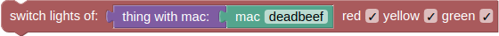

# BLAST Block Overview
This document describes the BLAST blocks in detail. For a formal syntax definiton check the first section [EBNF](#EBNF), for a more detailed describtion of a single block, click their respective category's section from the table of contents below.

Contents:
* [**EBNF**](#EBNF)
* [**Categories**](#categories)
* [**things**](#things-blocks)
* [**actions**](#action-blocks)
* [**logic**](#logic-blocks)
* [**text**](#text-blocks)
* [**numbers**](#number-blocks)

## EBNF
The following describes BLAST's syntax using the [W3C EBNF Notation](https://www.w3.org/TR/2010/REC-xquery-20101214/#EBNFNotation).

```
block-program            ::= (setup loop)
setup                    ::= ( action | conditional-statement )*
loop                     ::= ( action | conditional-statement )*
action                   ::= ( display-text | display-data | switch-lights)
conditional-statement    ::= ( if | if-else )
display-text             ::= (text | number | ibeacon-data)
display-data             ::= ibeacon receiver
switch-lights            ::= ibeacon
if                       ::= boolean ( action | conditional-statement )*
if-else                  ::= boolean ( action | conditional-statement )*
text                     ::= ( text-value | text-create )
number                   ::= ( number-value | number-infinity | arithmetic-operations | number-random )
ibeacon-data             ::= ibeacon receiver
ibeacon                  ::= iBeaconObject
boolean                  ::= ( boolean-value | comparison | logical-operation | not )
receiver                 ::= receiverObject
text-value               ::= StringLiteral
text-create              ::= text (text)*
number-value             ::= DoubleLiteral
number-infinity          ::= DoubleLiteral
arithmetic-operations    ::= number number
number-random            ::= number number
boolean-value            ::= booleanLiteral
comparison               ::= (number | text ) (number | text )
logical-operation        ::= boolean boolean
not                      ::= boolean
```


## Categories
In BLAST there are 5 categories of blocks:
* [**things**](#things-blocks): Blocks representing and retrieving data from things
* [**actions**](#action-blocks): Display measured data, custom messages or setting the LEDs of a signal light
* [**logic**](#logic-blocks): Everything concerning boolean logic, like if, if-else blocks and events
* [**text**](#text-blocks): Text creation and manipulation blocks
* [**numbers**](mumber-blocks): represent numbers and enable basic arithmetic

Descriptions of these blocks can be found in the following.

## things-blocks
There are 3 different blocks in this category: [**ibeacon**](#ibeacon), [**receiver**](#receiver) and [**ibeacon-data**](#ibeacon-data).

### ibeacon
The iBeacon block represents an iBeacon


to create a new iBeacon click the `create new thing` button in the things category.

**input:** *no input*  
**output:** *thing* - the address of the ibeacon's rdf graph

### receiver
The receiver block represents a bluetooth receiver.


to create a new receiver click the `create new receiver` button in the things category.

**input:** *no input*  
**output:** *receiver* - the address of the receiver's rdf graph

### ibeacon-data
The ibeacon-data block retrieves data from an ibeacon rdf graph.


**input:** *thing*, *reveiver*  
**output:** *string* | *number* - the retrieved data

## action blocks
There are 3 different blocks in this category: [**display text**](#display-text), [**display data**](#display-data) and [**switch lights**](#switch-lights). 

### display text
The display text block adds a text container to the actionblock output container on the right.


**input:** *text* | *number*  
**output:** *no output*

### display data
The display data block prints a table containing all the data received at a receiver to the actionblock output container on the right.


**input:** *receiver*  
**output:** *no output*

### switch lights
The switch lights block can be used to control the LEDs of a [LED strip controller](https://github.com/arduino12/ble_rgb_led_strip_controller).



**input:** *thing*  
**output:** *no output*

## logic blocks
Logic blocks are used to implement [boolean logic](https://en.wikipedia.org/wiki/Boolean_algebra).  

If a block expects a Boolean value as an input, it usually interprets an absent input as **false**. Non-Boolean values cannot be directly plugged in where Boolean values are expected.

### boolean-value
The value block represents a boolean value


**input:** *no input*  
**output:** *boolean* - the value selected in the dropdown

### comparison
There are six comparison operators. Each takes two inputs and returns true or false depending on how the inputs compare with each other.


The six operators are: equals, not equals, less than, greater than, less than or equal, greater than or equal.

**input:** (*text* | *number*), (*text* | *number*)  
**output:** *boolean*

### logical operation
This block represents the logical operations *and* and *or*.


**input:** *boolean*, *boolean*  
**output:** *boolean*

### not
The not block converts its Boolean input into its opposite. For example, the result of:  
  
is **false**

**input:** *boolean*  
**output:** *boolean*

### if
The simplest conditional statement is an **if** block, as shown:

When run, this will compare the RSSI value of the thing **my beacon** to -30. If it is larger, "Beacon is close!" will be displayed. Otherwise, nothing happens.

**input:** *boolean*  
**output:** {*action-block* | *logic block*}

### if-else
It is also possible to specify that something should happen if the condition is *not* true, as shown in this example:


As with the previous block, "Beacon is close!" will be displayed if the RSSI value of **my beacon** > -30; otherwise, "Beacon is not very close." will be displayed.
An **if** block may have zero or one **else** sections but not more than one.

## text blocks
Examples of pieces of text are:
* "thing #1"
* "March 12, 2010"
* "" (the empty text)

Text can contain letters (which may be lower-case or upper-case), numbers, punctuation marks, other symbols, and blank spaces between words.

### text-value
The following block creates the piece of text "hello".


**input:** *no input*
**output:** *text*

### text create
The create text with block combines (concatenates) the value of two text blocks to create the text "helloworld". Note that there is no space between them, since none was in either original text.


**input:** { *text* }  
**ouput** *text*

To increase the number of text inputs, click on the gear icon, which changes the view to:


Additional inputs are added by dragging an "item" block from the gray toolbox on the left into the "join" block.

## number blocks
Number blocks are used to create and modify numbers.

### number-value
The number-value block represents a numerical value


**input:** *no input*  
**output:** *number*

### infinity
The infinity block represent the *inifinty* contant.


**input:** *no input*  
**output:** *number*

### arithmetic operations
The arithmetic operations block is used to create simple arithmetic operations.


The available arithmetic operations are: addition, subtraction, multiplication, division and power.

**input:** *number*, *number*  
**output:** *number*

### random integer
This block creates a random integer in betwee the defined boundaries.


**input:** *number*, *number*  
**output:** *number*