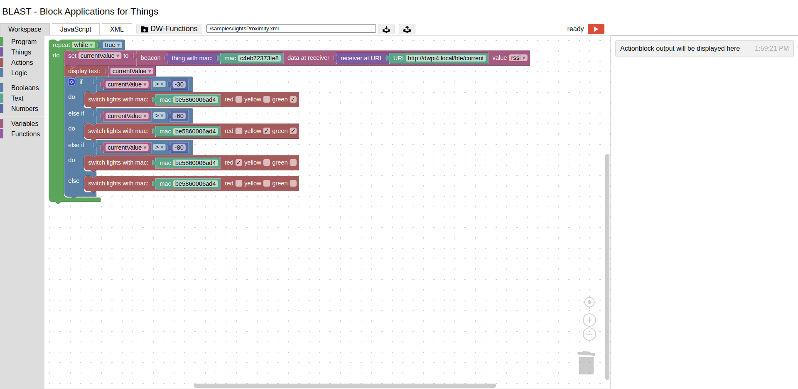

# BLAST Documentation

BLAST is an acronym for **Bl**ock **A**pplication**s** for **t**hings. It offers a web-based, visual programming environment based on Google's [Blockly](https://developers.google.com/blockly). 

In order to build and run a block-program, users can drag blocks together and then execute those by clicking the `execute` button on the bottom right. To stop a running program, click the `stop` button next to it.

In BLAST there are 6 categories of blocks:

* **program**: The setup- and repeat-block control the block programs process order
* **things**: Blocks representing and retrieving data from things
* **variables**: A variable is named value that can be changed (varies)
* **actions**: Display measured data, custom messages or setting the LEDs of a signal light
* **logic**: Everything concerning boolean logic, like if, if-else blocks and events
* **booleans**: A block representing a boolean value 
* **text**: Text creation and manipulation blocks
* **numbers**: represent numbers and enable basic arithmetic

This wiki aims to describe BLAST in detail. And currently consists of two sections:

- [**syntax.md**](./syntax.md) gives a formal definition of BLAST's syntax, and 
- [**semantics.md**](./semantics.md) describes its semantics.

## Related

* https://slashdot.org/comments.pl?sid=20649519&cid=62198449