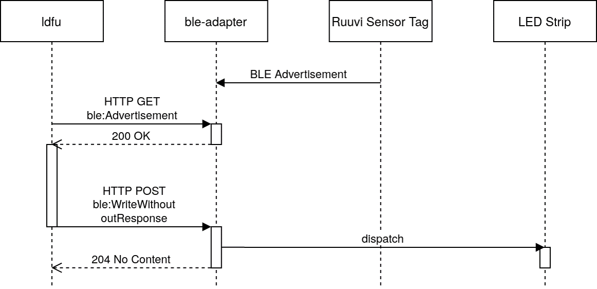

# Bluetooth Low Energy Communication

## Identifiers for Generic Characteristics

From https://btprodspecificationrefs.blob.core.windows.net/assigned-values/16-bit%20UUID%20Numbers%20Document.pdf:

Services group several characteristics together

GATT Characteristic and Object Type

* 0x2A00 Device Name

* 0x2A07 Tx Power Level
* 0x180F Battery
* 0x2A19 Battery Level

* 0x2A24 Model Number String
* 0x2A25 Serial Number String
* 0x2A26 Firmware Revision String
* 0x2A27 Hardware Revision String
* 0x2A28 Software Revision String
* 0x2A29 Manufacturer Name String

* 0X2AFB Illuminance
* 0x2A1C Temperature Measurement
* 0x2A1D Temperature Type
* 0x2A1E Intermediate Temperature
* 0x2A6C Elevation
* 0x2A6D Pressure
* 0x2A6E Temperature
* 0x2A6F Humidity
* 0x2A98 Weight
* 0x2AA3 Barometric Pressure Trend

## Push vs. Pull Communication

### GAP advertisement

GAP advertisement messages are "pushed" from the BLE peripheral (Ruuvi Sensor Tag in the figure) to the central (ble-adapter in the figure).

The Bluetooth central should also "push" the messages to the WoT layer, which would view the message as WoT Event.

### GATT

If the Bluetooth central reads the data via a "pull" model, the messages are viewed as results of reading a WoT Property.

BLE notify from the peripheral to the central could also be mapped to a WoT Event.
BLE notify requires a BLE subscribe and also an unsubscribe to setup the communication.