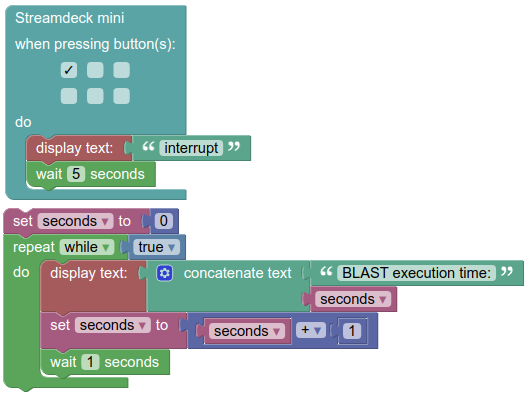

# Semantics <!-- omit in toc -->
This document explains what happens when a block program gets executed.

## Questions

* How to map the different low-level protocols to WoT? To BLAST?
  + BLE GAP advertisements of the Ruuvi tags to WoT read property (or should those be WoT events?)
  + BLE Huskyduino forget flag to WoT action
  + BLE Huskyduino face detection/object detection as WoT events?
  + BLE Xiaomi Mijia subscribe and notify to WoT read property (or rather: WoT observable property? handled similar to events)
* How to handle BLE connect/disconnect (see https://github.com/wintechis/blast/issues/115)?
* How to make BLAST programs appear to execute synchronously while JavaScript programs executes asynchronously?
  * [Playing sound synchronously vs. asynchronously](https://github.com/wintechis/blast/issues/22#issuecomment-758677857)
  + BLAST event loop vs. JavaScript event loop
  + For reference of the JavaScript event loop: [Event loop explainer](https://github.com/atotic/event-loop) and [Concurrency model and the event loop](https://developer.mozilla.org/en-US/docs/Web/JavaScript/EventLoop)
  + Is there a way to show the current state of a BLAST program execution, i.e., the values of all variables right now?
* How does the execution semantics of App Inventor with the execution semantics of Scratch? Hint: Events-first programming in APP inventor, Turbak, M Sherman, F Martin, D Wolber… - Journal of Computing …, 2014 - https://cs.wellesley.edu/~tinkerblocks/CCSCNE14-AI2-events-first-paper.pdf
* ...

## Code generation
Every time the workspace changes, i.e. a block is added, moved or removed, BLAST generates JavaScript code.

In order to generate this code, each block returns either a String with code-snippets, or a tuple consisting of such a string and an Integer value defining the [Operator Precedence](https://developers.google.com/blockly/guides/create-custom-blocks/operator-precedence). 

For example the code generation for the `play_audio` block looks as follows:
```JavaScript
Blockly.JavaScript['play_audio'] = function(block) {
  const uri = Blockly.JavaScript.valueToCode(
      block,
      'URI',
      Blockly.JavaScript.ORDER_NONE,
  );
  const code = `playAudioFromURI(${uri});\n`;
  return code;
};
```

The JavaScript files responsible for Block's code generation can be found at [src/generators/](../src/generators/)

## Execution
When a user clicks the execute button, BLAST uses a [JSInterpreter](https://neil.fraser.name/software/JS-Interpreter/docs.html) instance to execute the generated JavaScript in a sand-boxed JavaScript environment.

## Events vs State transitions
In addition to the sequential block code, Blast evaluates events emitted by things and state transitions.  

### Events
Events are emitted by WOT things, see [event description of the W3C](https://www.w3.org/TR/wot-architecture/#events). When an event occurs, BLAST execution is interrupted until the code triggered by the event has finished.

The example below, will display `BLAST execution time: 0`, `BLAST execution time: 1`, `BLAST execution time: 2`,... every second until the top left button on the connected streamdeck mini is pushed.
Then the message `interrupt` is displayed and after 5 seconds the output is going to continue where interrupted.



Here's an example output, button is pushed after 3 seconds:

`BLAST execution time: 0`  
`BLAST execution time: 1`  
`BLAST execution time: 2`  
`BLAST execution time: 3`  
`interupt`  
`BLAST execution time: 4`  
`BLAST execution time: 5`  
...


### State transitions
The state blocks enable checking for state transitions. To continuously check for those, BLAST's state transition checker is executed in parallel by a 2nd instance of the JSInterpreter.

TODO add parallel Example
