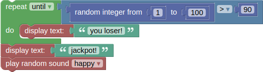

# Grammar <!-- omit in toc -->

This document describes in BLAST's grammar using [EBNF](https://en.wikipedia.org/wiki/Extended_Backus%E2%80%93Naur_form). As all blocks get translated into JavaScript the resulting language is a subset of JS.

- [1. Extended Backus-Naur Form](#1-extended-backus-naur-form)
  - [1.1. Notation](#11-notation)
- [2. Lexical structure](#2-lexical-structure)
  - [2.1. Terminal Symbols](#21-terminal-symbols)
- [Example program EBNF](#example-program-ebnf)

# 1. Extended Backus-Naur Form

This grammar of BLAST uses the [W3C's Extended Backus-Naur Form (EBNF)](https://www.w3.org/TR/2010/REC-xquery-20101214/#EBNFNotation)

The terminal symbols for this grammar include the quoted strings used in the production rules below, and the terminal symbols defined in section  [2.1. Terminal Symbols](#21-terminal-symbols).

The EBNF notation is described in more detail in [1.1 Notation ](#28-number-blocks-semantics).


**block programs**

```ebnf
block_program            ::= statement+
statement                ::= ( control_flow_statement | action_statement ) ";"
```

**control flow**
```ebnf
control_flow_statement   ::= ( repeat | while_until | for | conditional_statement | break )
conditional_statement    ::= "if (" boolean_expression ") {" statement* "}"
repeat                   ::= "for (var count = 0; count <" number "; count++) {" statement* "}"
while_until              ::= "while(" "!"? conditional_statement ") {" statement* "}"
for                      ::= "for (i = " number "; i <=" number "; i +=" number ") {" statement* "}"
break_continue           ::= ( "break" | "continue" )
```

**actions**
```ebnf
action_statement         ::= ( display_text | display_table | switch_lights | play_sound | wait )
display_text             ::= "displayText(" ( string | number ) ")"
display_table            ::= "displayData(" http_request ")"
switch_lights            ::= "switchLights(" MAC "," Boolean_Literal "," Boolean_Literal "," Boolean_Literal ")"
play_audio               ::= "playAudioFromURI(" ( "happy" | "sad") ")"
wait                     ::= "waitForSeconds(" number ")"
http_request             ::= "sendHttpRequest(" URI "," ( "GET" | "PUT" | "POST" | "DELETE" ) "," string_value "," string_value "," ( "status" | "response" ) ")"
sparql_query             ::= "urdfQueryWrapper(" URI "," string ")"
sparql_ask               ::= "urdfQueryWrapper(" URI "," string ")"
```

**boolean expressions**
```ebnf
boolean_expression       ::= ( comparison | logical_operation | boolean_value | not )
comparison               ::= "(" ( number | string ) ("=" | "!=" | "<" | "<=" | ">" | ">=" ) ( number | string ) ")"
logical_operation        ::= boolean_expression boolean_expression
not                      ::= boolean_expression
```

**strings**
```ebnf
string                   ::= ( string_value | string_operation )
string_value             ::= String_Literal  
string_operation         ::= ( string_concat | string_length | string_index_of | string_char_at | string_substring | string_change_case | string_replace )
string_concat            ::= string (string)+
string_length            ::= string
string_index_of          ::= string string
string_char_at           ::= string number
string_substring         ::= string number number
string_change_case       ::= string
string_replace           ::= string string string
```


**numbers**
```ebnf
number                   ::= ( number_value | number_infinity | number_arithmetic | number_random )
number_value             ::= Double_Literal
number_infinity          ::= "Infinity"
number_arithmetic        ::= ( number "+" | "-" | "*" | "/"  number ) | "Math.pow(" Number ", " Number ")"
number_random            ::= "mathRandom(" number ", " number ")"
```

**booleans**
```ebnf
boolean_value            ::= Boolean_Literal
```

## 1.1. Notation
This section explains all relevant definitions of the [W3C's Extended Backus-Naur Form (EBNF)](https://www.w3.org/TR/2010/REC-xquery-20101214/#EBNFNotation).
> Definition: Each rule in the grammar defines one **symbol**, using the following format:
> ```ebnf
> symbol ::= expression
> ```

> Definition: A **terminal** is a symbol or string or pattern that can appear in the right-hand side of a rule, but never appears on the left-hand side in the main grammar, although it may appear on the left-hand side of a rule in the grammar for terminals.

The following constructs are used to match strings of one or more characters in a terminal:

| construct    | description                                                      |
| ------------ | ---------------------------------------------------------------- |
| `#xN` | where N is a hexadecimal integer, the expression matches the character whose number (code point) in ISO/IEC 10646 is N. The number of leading zeros in the #xN form is insignificant.
| `[a-zA-Z], , [#xN-#xN]` | any Char with a value in the range(s) indicated (inclusive).     |
| `[abc], [#xN#xN#xN]`    | any Char with a value among the characters enumerated.           |
| `"string"` | the sequence of characters that appear inside the single quotes. |

Patterns (including the above constructs) can be combined with grammatical operators to form more complex patterns, matching more complex sets of character strings. In the examples that follow, A and B represent (sub-)patterns.

| pattern      | description                                                          |
| ------------ | -------------------------------------------------------------------- |
| `(A)`      | `A` is treated as a unit and may be combined as described in this list.|
| `A?` | matches `A` or nothing; optional `A`. |
| `A B` | matches `A` followed by `B`. This operator has higher precedence than alternation; thus `A B | C D` is identical to `(A B) | (C D)`. |
| `A \| B`  | matches A or B but not both. |
| `A+` | matches one or more occurrences of `A`. Concatenation has higher precedence than alternation; thus `A+ | B+` is identical to `(A+) | (B+)`. |
| `A*` | matches zero or more occurrences of `A`. Concatenation has higher precedence than alternation; thus `A* | B*` is identical to `(A*) | (B*)` |


# 2. Lexical structure

The terminal symbols assumed by the grammar above are described in this section.

Quoted strings appearing in production rules are terminal symbols.

Other terminal symbols are defined in [2.1 Terminal Symbols](#21-terminal-symbols).

When tokenizing, the longest possible match that is consistent with the EBNF is used.

## 2.1. Terminal Symbols

**identifiers**
```ebnf
URI                      ::= String_Literal
MAC                      ::= String_Literal
```

**symbols**
```ebnf
String_Literal           ::= "'" Char+ "'"
Double_Literal           ::= (("." Digits) | (Digits ("." [0-9]*)?)) [eE] [+-]? Digits
Boolean_Literal          ::= "true" | "false"
```

The following symbols are used only in the definition of terminal symbols; they are not terminal symbols in the grammar of [1. Extended Backus-Naur Form](#1-extended-backus-naur-form).
```ebnf
Digits                   ::= [0-9]+
Char                     ::= #x9 | #xA | #xD | [#x20-#xD7FF] | [#xE000-#xFFFD] | [#x10000-#x10FFFF]	/* any Unicode character, excluding the surrogate blocks, FFFE, and FFFF. */
```

# Example program EBNF
This section provides a syntax description of [gamble](../samples/gamble.xml), one of BLAST's sample programs. 

Here's what the program's blocks look like:



Its corresponding JavaScript can be generated using the rules of the grammar of [1. Extended Backus-Naur Form](#1-extended-backus-naur-form):
```JavaScript
while (!(mathRandomInt(1, 100) > 90)) {
    displayText('you loser!');
  }
displayText('jackpot!');
playRandomSoundFromCategory('happy');
```