# Syntax <!-- omit in toc -->

This section gives an overview of the syntax used in BLAST.

- [1. Extended Backus-Naur Form](#1-extended-backus-naur-form)
  - [1.1. block programs](#11-block-programs)
  - [loops](#loops)
  - [1.4. actions](#14-actions)
  - [1.5. conditions](#15-conditions)
  - [1.6. text blocks](#16-text-blocks)
  - [1.7. number blocks](#17-number-blocks)
  - [1.8. booleans blocks](#18-booleans-blocks)
  - [1.9. Symbols](#19-symbols)
- [2. block syntax TODO](#2-block-syntax-todo)
  - [2.1. program-blocks syntax](#21-program-blocks-syntax)
    - [2.1.1. setup-syntax](#211-setup-syntax)
    - [2.1.2. repeat-syntax](#212-repeat-syntax)
  - [2.2. things-blocks syntax](#22-things-blocks-syntax)
    - [2.2.1. iBeacon-syntax](#221-ibeacon-syntax)
    - [2.2.2. receiver-syntax](#222-receiver-syntax)
    - [2.2.3. iBeacon-data](#223-ibeacon-data)
  - [2.3. variables blocks syntax](#23-variables-blocks-syntax)
    - [2.3.1. variables set syntax](#231-variables-set-syntax)
    - [2.3.2. variables get syntax](#232-variables-get-syntax)
    - [2.3.3. variables change syntax](#233-variables-change-syntax)
  - [2.4. action blocks syntax](#24-action-blocks-syntax)
    - [2.4.1. display text syntax](#241-display-text-syntax)
    - [2.4.2. display table syntax](#242-display-table-syntax)
    - [2.4.3. switch lights syntax](#243-switch-lights-syntax)
    - [2.4.4. random sound syntax](#244-random-sound-syntax)
    - [2.4.5. halt syntax](#245-halt-syntax)
  - [2.5. logic blocks syntax](#25-logic-blocks-syntax)
    - [2.5.1. comparison syntax](#251-comparison-syntax)
    - [2.5.2. AND / OR syntax](#252-and--or-syntax)
    - [2.5.3. not syntax](#253-not-syntax)
    - [2.5.4. if / if-else syntax](#254-if--if-else-syntax)
    - [2.5.5. event syntax](#255-event-syntax)
  - [2.6. boolean blocks syntax](#26-boolean-blocks-syntax)
    - [2.6.1. boolean_value syntax](#261-boolean_value-syntax)
  - [2.7. text blocks syntax](#27-text-blocks-syntax)
      - [2.7.0.1. URI syntax](#2701-uri-syntax)
      - [2.7.0.2. mac syntax](#2702-mac-syntax)
    - [2.7.1. text_value syntax](#271-text_value-syntax)
    - [2.7.2. text_concat syntax](#272-text_concat-syntax)
  - [2.8. number blocks syntax](#28-number-blocks-syntax)
    - [2.8.1. number_value syntax](#281-number_value-syntax)
    - [2.8.2. infinity syntax](#282-infinity-syntax)
    - [2.8.3. arithmetic operations syntax](#283-arithmetic-operations-syntax)
    - [2.8.4. random integer syntax](#284-random-integer-syntax)

# 1. Extended Backus-Naur Form

The following describes BLAST's syntax using the [W3C EBNF Notation](https://www.w3.org/TR/2010/REC-xquery-20101214/#EBNFNotation).

## 1.1. block programs

<pre>
block_program            ::= <a href='#ebnf-statement'>statement</a>+
statement                ::= ( <a href='#ebnf-loop'>loop</a> | <a href='ebnf-action_statement'>action_statement</a> | <a href='ebnf-conditional_statement'>conditional_statement</a> | <a href='ebnf-function'>function</a> )
</pre>

## loops
<pre>
loop                     ::= ( <a href='ebnf-loops_repeat'>loops_repeat</a> | <a href='ebnf-loops_while_until'>loops_while_until</a> | <a href='ebnf-loops_for'>loops_for</a> )
loops_repeat                   ::= repeat <a href='#ebnf-number'>number</a> times do <a href='#ebnf-statement'>statement</a>*
loops_while_until               ::= repeat ( while | until ) <a href='#ebnf-conditional_statement'>conditional_statement</a> do <a href='#ebnf-statement'>statement</a>*
loops_for                      ::= count with var from <a href='#ebnf-number'>number</a> to <a href='#ebnf-number'>number</a> by <a href='#ebnf-number'>number</a> do <a href='#ebnf-statement'>statement</a>*
</pre>

## 1.4. actions
<pre>
action_statement         ::= ( <a href='#ebnf-display_text'>display_text</a> | <a href='#ebnf-display_table'>display_table</a> | <a href='#ebnf-switch_lights'>switch_lights</a> | <a href='#ebnf-play_sound'>play_sound</a> | <a href='#ebnf-halt'>halt</a> | <a href='ebnf-break'>break</a> | <a href='ebnf-wait'>wait</a> )
display_text             ::= displayText ( ( <a href='#ebnf-text'>text</a> | <a href='#ebnf-number'>number</a> ) )
display_table            ::= displayData ( <a href='#ebnf-table'>table</a> )
switch_lights            ::= switch_lights ( <a href='#ebnf-mac'>mac</a> , <a href='#ebnf-Boolean_Literal'>Boolean_Literal</a> , <a href='#ebnf-Boolean_Literal'>Boolean_Literal</a> , <a href='#ebnf-Boolean_Literal'>Boolean_Literal</a> )
play_sound               ::= playRandomSoundFromCategory ( ( 'happy' | 'sad') )
break                    ::= ( break | continue )
wait                     ::= waitForSeconds( <a href='#ebnf-number'>number</a> )
http_request             ::= sendHttpRequest( <a href='ebnf-URI'>URI</a>, ( 'GET' | 'PUT' | 'POST' | 'DELETE' ), <a href='#ebnf-text_value'>text_value</a>, <a href='#ebnf-text_value'>text_value</a>, ( 'status' | 'response' ) )
sparql_query             ::= urdfQueryWrapper( <a href='ebnf-URI'>URI</a>, <a href='#ebnf-text'>text</a> )
sparql_ask               ::= urdfQueryWrapper( <a href='ebnf-URI'>URI</a>, <a href='#ebnf-text'>text</a> )
</pre>

## 1.5. conditions
<pre>
conditional_statement    ::= if <a href='#ebnf-boolean_expression'>boolean_expression</a> then do <a href='#ebnf-statement'>statement</a>*
boolean_expression       ::= ( <a href='#ebnf-comparison'>comparison</a> | <a href='#ebnf-logical-comparison'>logical_operation</a> | <a href='#ebnf-boolean_value'>boolean_value</a> | <a href='#ebnf-not'>not</a> )
comparison               ::= ( <a href='#ebnf-number'>number</a> | <a href='#ebnf-text'>text</a> ) ( <a href='#ebnf-number'>number</a> | <a href='#ebnf-text'>text</a> )
logical_operation        ::= <a href='#ebnf-boolean_expression'>boolean_expression</a> <a href='#ebnf-boolean_expression'>boolean_expression</a>
not                      ::= <a href='#ebnf-boolean_expression'>boolean_expression</a>
</pre>

## 1.6. text blocks
<pre>
text                     ::= ( <a href='#ebnf-text_value'>text_value</a> | <a href='#ebnf-text_operation'>text_operation</a> )
text_value               ::= <a href='#ebnf-String_Literal'>String_Literal</a>  
text_operation           ::= ( <a href='text_concat'>text_concat</a> | <a href='text_length'>text_length</a> | <a href='ebnf-text_index_of'>text_index_of</a> | <a href='ebnf-text_char_at'>text_char_at</a> | <a href='ebnf-text_substring'>text_substring</a> | <a href='ebnf-text_change_case'>text_change_case</a> | <a href='ebnf-text_replace'>text_replace</a> )
text_concat              ::= <a href='#ebnf-text'>text</a> (<a href='#ebnf-text'>text</a>)+
text_length              ::= <a href='ebnf-text'>text</a>
text_index_of            ::= <a href='ebnf-text'>text</a> <a href='ebnf-text'>text</a>
text_char_at             ::= <a href='ebnf-text'>text</a> <a href='#ebnf-number'>number</a>
text_substring           ::= <a href='ebnf-text'>text</a> <a href='#ebnf-number'>number</a> <a href='#ebnf-number'>number</a>
text_change_case         ::= <a href='ebnf-text'>text</a>
text_replace             ::= <a href='ebnf-text'>text</a> <a href='ebnf-text'>text</a> <a href='ebnf-text'>text</a>
</pre>

## 1.7. number blocks
<pre>
number                   ::= ( <a href='#ebnf-number_value'>number_value</a> | <a href='#ebnf-number_infinity'>number_infinity</a> | <a href='#ebnf-number_arithmetic'>number_arithmetic</a> | <a href='#ebnf-number_random'>number_random</a> )
number_value             ::= <a href='#ebnf-Double_Literal'>Double_Literal</a>
number_infinity          ::= <a href='#ebnf-Double_Literal'>Double_Literal</a>
number_arithmetic    ::= <a href='#ebnf-number'>number</a> <a href='#ebnf-number'>number</a>
number_random            ::= <a href='#ebnf-number'>number</a> '+' | '-' | 'x' | '÷' | '^' <a href='#ebnf-number'>number</a>
</pre>

## 1.8. booleans blocks
<pre>
boolean_value            ::= <a href='#ebnf-Boolean_Literal'>Boolean_Literal</a>
</pre>

## 1.9. Symbols
<pre>
URI                      ::= <a href='#ebnf-String_Literal'>String_Literal</a>
MAC                      ::= <a href='#ebnf-String_Literal'>String_Literal</a>
String_Literal            ::= /* any visible character and the white-space character, no termination characters */
Double_Literal            ::= (('.' <a href='#ebnf-Digits'>Digits</a>) | (<a href='#ebnf-Digits'>Digits</a> ('.' [0-9]*)?)) [eE] [+-]? <a href='#ebnf-Digits'>Digits</a>
Digits                   ::= [0-9]+
Boolean_Literal           ::= true | false
</pre>

# 2. block syntax TODO

## 2.1. program-blocks syntax

### 2.1.1. setup-syntax

**input:** *action* or *conditional statement*  
**output:** *no output*

### 2.1.2. repeat-syntax

**input:** *number* *number*  
**output:** *no output*

## 2.2. things-blocks syntax

There are 3 different blocks in this category: **iBeacon**, **receiver** and **iBeacon-data**.

### 2.2.1. iBeacon-syntax

**input:** *URI*  
**output:** *thing*

### 2.2.2. receiver-syntax

**input:** *MAC*  
**output:** *receiver*

### 2.2.3. iBeacon-data
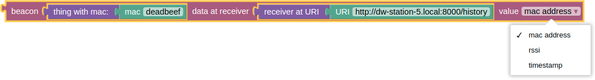

**input:** *thing*  *receiver*  
**output:** *string* | *number* - the retrieved data

## 2.3. variables blocks syntax

### 2.3.1. variables set syntax
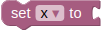

**input:** *text* | *number*  
**output:** *no output*

### 2.3.2. variables get syntax

**input:** *no input*  
**output:** *text* | *number*

### 2.3.3. variables change syntax
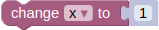

**input:** *text* | *number*  
**output:** *no output*

## 2.4. action blocks syntax

There are 5 different blocks in this category: **display text**, **display data**, **switch lights**, **random sound** and **halt**

### 2.4.1. display text syntax
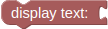

**input:** *text* | *number*  
**output:** *no output*

### 2.4.2. display table syntax
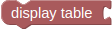

**input:** *receiver*  
**output:** *no output*

### 2.4.3. switch lights syntax
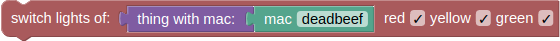

**input:** *iBeacon*  
**output:** *no output*

### 2.4.4. random sound syntax
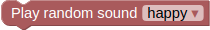

**input:** *no input*
**output:** *no output*

### 2.4.5. halt syntax
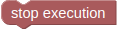

**input:** *no input*
**output:** *no output*

## 2.5. logic blocks syntax

### 2.5.1. comparison syntax
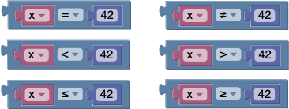

**input:** (*text* | *number*), (*text* | *number*)  
**output:** *boolean*

### 2.5.2. AND / OR syntax

**input:** *boolean*, *boolean*  
**output:** *boolean*

### 2.5.3. not syntax

**input:** *boolean*  
**output:** *boolean*

### 2.5.4. if / if-else syntax

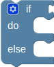

**input:** *boolean* (*action* | *conditional_statement*)*  
**output:** *conditional_statement*

### 2.5.5. event syntax

**input:** *URI* ( *text* | *number* )  
**output:** *boolean*

## 2.6. boolean blocks syntax

### 2.6.1. boolean_value syntax

**input:** *no input*  
**output:** *boolean*

## 2.7. text blocks syntax

#### 2.7.0.1. URI syntax

**input:** *no input*  
**output:** *URI*

#### 2.7.0.2. mac syntax

**input:** *no input*  
**output:** *MAC*

### 2.7.1. text_value syntax

**input:** *no input*  
**output:** *text*

### 2.7.2. text_concat syntax

**input:** { *text* }  
**output** *text*

## 2.8. number blocks syntax

### 2.8.1. number_value syntax

**input:** *no input*  
**output:** *number*

### 2.8.2. infinity syntax

**input:** *no input*  
**output:** *number*

### 2.8.3. arithmetic operations syntax
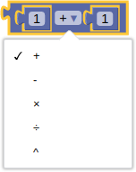

**input:** *number* *number*  
**output:** *number*

### 2.8.4. random integer syntax

**input:** *number* *number*  
**output:** *number*
